# Gallery

This article showcases the range of flow diagrams that can be produced
by `selecta`, spanning from the major EQUATOR reporting guidelines to
more esoteric layouts. Each example displays the complete pipeline code
alongside the subsequent rendered output. Diagrams cover both data
operating modes (data-driven with built-in datasets *vs.* manual with
hand-entered counts), multiple arm configurations (0-arm observational
through 6-arm dose-finding), converging multi-source layouts,
split-and-recombine flows, and nested factorial flows, as well as
principal options for typographic and numeric presentation. Both
supported graphics rendering engines (`grid` and Graphviz DOT) are
represented. All figures are rendered with
[`flowchart()`](https://phmcc.codeberg.page/selecta/reference/flowchart.md)
at default settings unless noted otherwise.

For detailed usage guidance, see the package vignettes: [Enrollment
Diagrams](https://phmcc.codeberg.page/selecta/articles/enrollment_diagrams.md)
(CONSORT, STROBE, STARD), [Systematic
Reviews](https://phmcc.codeberg.page/selecta/articles/systematic_reviews.md)
(PRISMA, MOOSE), [Split-and-Recombine
Diagrams](https://phmcc.codeberg.page/selecta/articles/split_recombine.md)
(screening validation, exposure classification), [Graphviz
Export](https://phmcc.codeberg.page/selecta/articles/graphviz_export.md)
(DOT/DiagrammeR), and [Advanced
Workflows](https://phmcc.codeberg.page/selecta/articles/advanced_workflows.md).

> *n.b.:* To ensure correct font rendering and figure sizing, the
> `grid`-based diagrams below are displayed using a vignette-only helper
> function (`queue_flow()`) that applies recommended dimensions from
> [`recdims()`](https://phmcc.codeberg.page/selecta/reference/recdims.md)
> via the [`ragg`](https://ragg.r-lib.org/) graphics device, with the
> standard output function applied afterwards
> ([`flowchart()`](https://phmcc.codeberg.page/selecta/reference/flowchart.md)).
> In practice, replace this
> `queue_flow()`/[`flowchart()`](https://phmcc.codeberg.page/selecta/reference/flowchart.md)
> workflow with a call to
> [`flowsave()`](https://phmcc.codeberg.page/selecta/reference/flowsave.md)
> for equivalent printed results:
>
> ``` r
> flowsave(flow, "consort.pdf")
> flowsave(flow, "consort.png", dpi = 300)
> ```
>
> Using
> [`flowsave()`](https://phmcc.codeberg.page/selecta/reference/flowsave.md)
> ensures that the figure dimensions are always large enough to
> accommodate the diagram content, and it is the preferred method for
> saving flow diagram outputs in `selecta`.

``` r
library(selecta)
library(data.table)

data(selectaex0)
data(selectaex2)
data(selectaex3)
data(selectaex6)
```

------------------------------------------------------------------------

## Single-Flow Diagrams

Single-flow diagrams have no arm splits or source convergence. The
population enters at the top, passes through one or more exclusion
steps, and exits at a single endpoint. This is the simplest topology and
the building block for all others.

### **Example 1:** Minimal Enrollment Flow, Manual

The simplest possible `selecta` pipeline: a starting population and a
terminal endpoint with no exclusions, arms, or phases.

``` r
flow1 <- enroll(n = 100, label = "Assessed for eligibility") |>
    endpoint("Included in analysis")
```

``` r
flowchart(flow1)
```

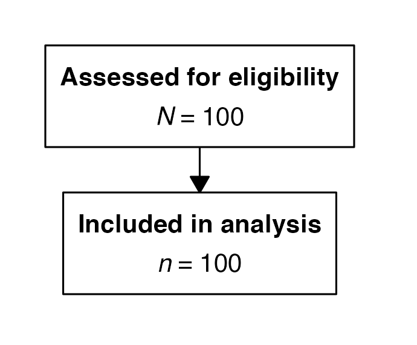

### **Example 2:** Sequential Exclusions without Count Boxes, Manual

Four consecutive exclusion steps with `show_count = FALSE`, stacking
their side boxes alongside a single uninterrupted main flow. This
pattern is common in PRISMA-style screening where multiple removal
criteria are listed without intermediate population counts.

``` r
flow2 <- enroll(n = 2000, label = "Records identified") |>
    phase("Screening") |>
    exclude("Duplicates", n = 300, show_count = FALSE) |>
    exclude("Not in English", n = 50, show_count = FALSE) |>
    exclude("Conference abstracts only", n = 80, show_count = FALSE) |>
    exclude("No full text available", n = 20) |>
    phase("Analysis") |>
    endpoint("Studies included")
```

``` r
flowchart(flow2)
```

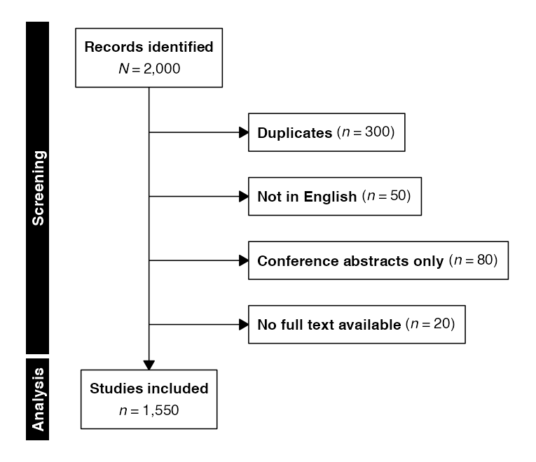

### **Example 3:** Data-Driven Simple Selection Flow (STROBE), Count-First

A single-arm observational cohort built entirely from the `selectaex0`
dataset. All counts are computed automatically from exclusion
expressions, and the sub-reasons for each exclusion are tabulated from a
column in the data. The `count_first = TRUE` option places bold counts
to the left of each label, a format common in certain clinical journals.

``` r
flow3 <- enroll(selectaex0, id = "patient_id") |>
    phase("Screening") |>
    exclude("Duplicate records", criterion = is_duplicate == TRUE,
            included_label = "Unique records") |>
    exclude("Failed eligibility",
            criterion = eligible == FALSE & is_duplicate == FALSE,
            reasons = "exclusion_reason",
            included_label = "Eligible cohort") |>
    phase("Follow-up") |>
    exclude("Lost to follow-up",
            criterion = lost_to_followup == TRUE,
            reasons = "followup_loss_reason") |>
    phase("Analysis") |>
    endpoint("Analysis cohort")
```

``` r
flowchart(flow3, count_first = TRUE)
```

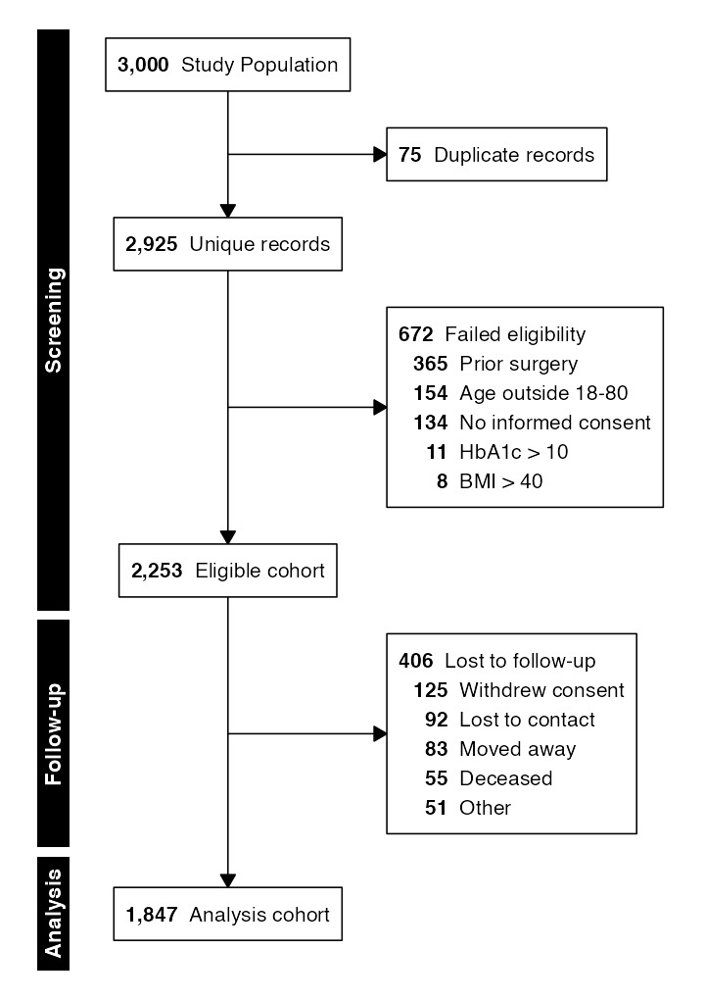

### **Example 4:** Hierarchical Exclusion Reasons

When `reasons` is a named list, each element is a broad category whose
value is either a named vector of sub-reasons or a single count. The
side box lists each category as a parent with its sub-reasons indented
beneath:

``` r
flow4 <- enroll(n = 2000, label = "Patients assessed") |>
    phase("Screening") |>
    exclude("Excluded", n = 520,
            reasons = list(
                "Clinical ineligibility" = c(
                    "Out of age range"           = 140,
                    "Contraindicated medication" = 110,
                    "Out-of-range biomarker"     = 70),
                "Consent not obtained" = c(
                    "Declined"          = 130,
                    "Unable to consent" = 40),
                "Logistical" = 30),
            included_label = "Enrolled") |>
    phase("Analysis") |>
    endpoint("Analysis population")
```

``` r
flowchart(flow4)
```

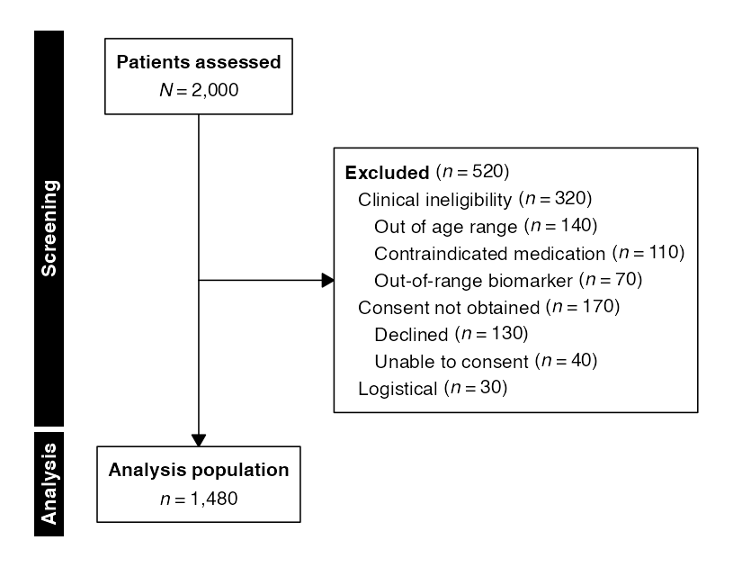

------------------------------------------------------------------------

## Parallel-Arm Diagrams (CONSORT / STROBE / STARD)

Parallel-arm diagrams use
[`allocate()`](https://phmcc.codeberg.page/selecta/reference/stratify.md)
or
[`stratify()`](https://phmcc.codeberg.page/selecta/reference/stratify.md)
to split the flow into independent columns that proceed to their own
endpoints. This is the standard topology for CONSORT randomized trials
and STROBE observational studies with exposure groups. Subsequent
[`exclude()`](https://phmcc.codeberg.page/selecta/reference/exclude.md)
calls apply within each arm independently. Diagnostic-accuracy (STARD)
flows share this structure, splitting on the index-test result with
[`stratify()`](https://phmcc.codeberg.page/selecta/reference/stratify.md).

### **Example 5:** Data-Driven Two-Arm Randomization Flow (CONSORT)

A standard two-arm CONSORT diagram derived from the `selectaex2`
dataset. The
[`allocate()`](https://phmcc.codeberg.page/selecta/reference/stratify.md)
function splits on the `treatment` column; subsequent
[`exclude()`](https://phmcc.codeberg.page/selecta/reference/exclude.md)
calls apply independently within each arm, with discontinuation reasons
tabulated automatically and ordered by global totals across arms.

``` r
flow5 <- enroll(selectaex2, id = "patient_id") |>
    phase("Screening") |>
    exclude("Duplicate records", criterion = is_duplicate == TRUE,
            included_label = "Unique records") |>
    exclude("Failed eligibility", criterion = eligible == FALSE,
            reasons = "exclusion_reason",
            included_label = "Eligible cohort") |>
    phase("Allocation") |>
    allocate("treatment") |>
    phase("Follow-up") |>
    exclude("Discontinued", criterion = discontinued == TRUE,
            reasons = "discontinuation_reason") |>
    phase("Analysis") |>
    endpoint("Analysis cohort")
```

``` r
flowchart(flow5)
```

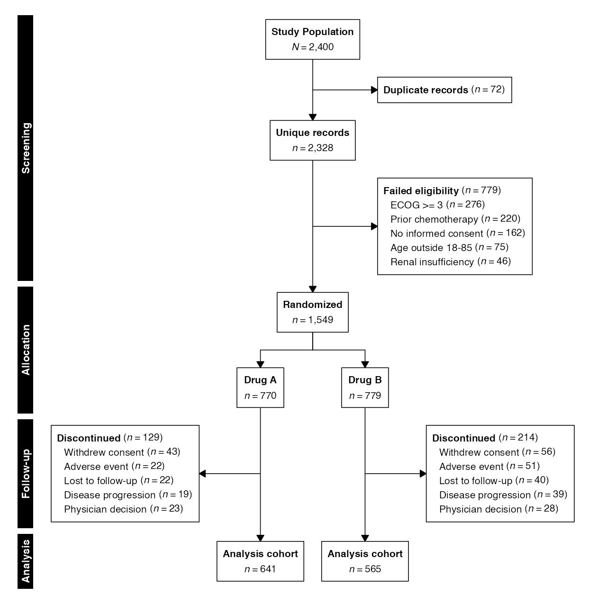

### **Example 6:** Manual Two-Arm CONSORT with Custom Styling

A manually specified CONSORT diagram demonstrating the full styling
parameter set. The `included_label` on the first exclusion produces an
explicit “Randomized” count box; per-arm discontinuation reasons are
supplied as a list of named vectors. The visual style applies a
coordinated blue palette across all six color parameters.

``` r
flow6 <- enroll(n = 1200, label = "Assessed for eligibility") |>
    phase("Enrollment") |>
    exclude("Excluded", n = 300,
            reasons = c("Not meeting criteria" = 160,
                        "Declined to participate" = 90,
                        "Other reasons" = 50),
            included_label = "Randomized") |>
    phase("Allocation") |>
    allocate(labels = c("Intervention", "Control"), n = c(450, 450)) |>
    phase("Follow-up") |>
    exclude("Lost to follow-up", n = c(18, 22),
            reasons = list(
                c("Withdrew consent" = 10, "Adverse event" = 8),
                c("Withdrew consent" = 14, "Relocated" = 8)
            )) |>
    phase("Analysis") |>
    endpoint("Analyzed")
```

``` r
flowchart(flow6,
          cex            = 1.0,
          cex_side       = 0.8,
          cex_phase      = 1.0,
          box_fill       = "#f0f5ff",
          side_fill      = "#e8eef9",
          border_col     = "#1a365d",
          arrow_col      = "#2c5282",
          phase_fill     = "#2c5282",
          phase_text_col = "#ffffff")
```

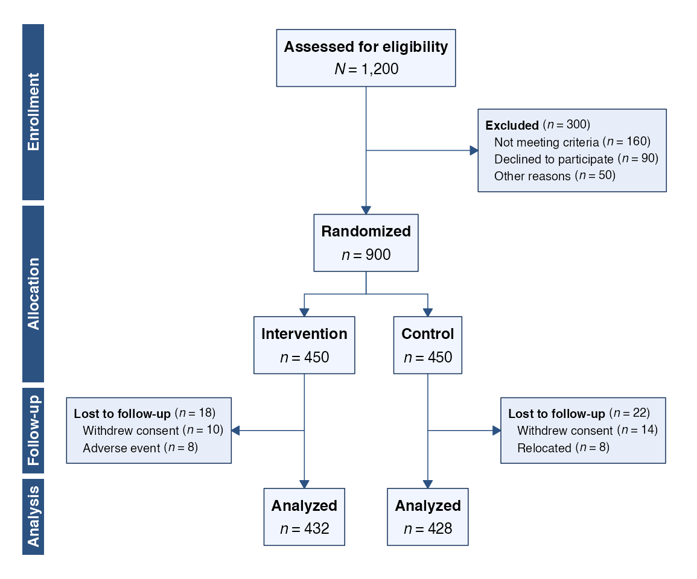

### **Example 7:** Data-Driven Three-Arm Randomization Flow (CONSORT), Count-First

A three-arm trial layout from the `selectaex3` dataset, rendered in
count-first mode. The layout engine uses uniform column widths so that
the split arrows fan out symmetrically regardless of individual arm box
widths. Per-arm side boxes are placed to the right of each column.

``` r
flow7 <- enroll(selectaex3, id = "patient_id") |>
    phase("Screening") |>
    exclude("Duplicate records", criterion = is_duplicate == TRUE,
            included_label = "Unique records") |>
    exclude("Failed eligibility", criterion = eligible == FALSE,
            reasons = "exclusion_reason",
            included_label = "Eligible cohort") |>
    phase("Allocation") |>
    allocate("treatment") |>
    phase("Follow-up") |>
    exclude("Discontinued", criterion = discontinued == TRUE,
            reasons = "discontinuation_reason") |>
    phase("Analysis") |>
    endpoint("Analysis cohort")
```

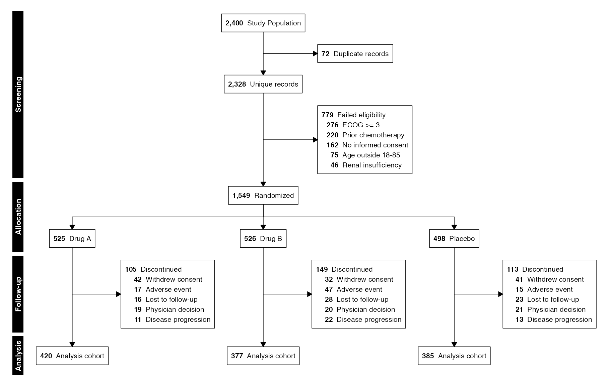

### **Example 8:** STROBE Observational Study with Per-Arm Labels, Manual

A STROBE-style observational cohort study where the
[`exclude()`](https://phmcc.codeberg.page/selecta/reference/exclude.md)
function receives per-arm label vectors after
[`stratify()`](https://phmcc.codeberg.page/selecta/reference/stratify.md).
The exposed and unexposed groups have distinct attrition descriptions
(“Treatment discontinued” vs. “Initiated treatment”), and distinct
included labels (“Continued treatment” vs. “Remained unexposed”),
reflecting the different clinical meanings of loss in each group.

``` r
flow8 <- enroll(n = 5000, label = "Source population") |>
    phase("Eligibility") |>
    exclude("Did not meet inclusion criteria", n = 800,
            reasons = c("Age outside range" = 340,
                        "Prior treatment" = 280,
                        "Comorbidity" = 180),
            included_label = "Met inclusion criteria") |>
    exclude("Declined to participate", n = 340) |>
    phase("Baseline") |>
    stratify(labels = c("Exposed", "Unexposed"), n = c(1900, 1960),
             label = "Classified by exposure") |>
    phase("Follow-up") |>
    exclude(c("Treatment discontinued", "Initiated treatment"),
            n = c(45, 52),
            included_label = c("Continued treatment",
                               "Remained unexposed")) |>
    exclude("Withdrew consent", n = c(12, 18)) |>
    phase("Analysis") |>
    endpoint("Included in analysis")
```

``` r
flowchart(flow8)
```

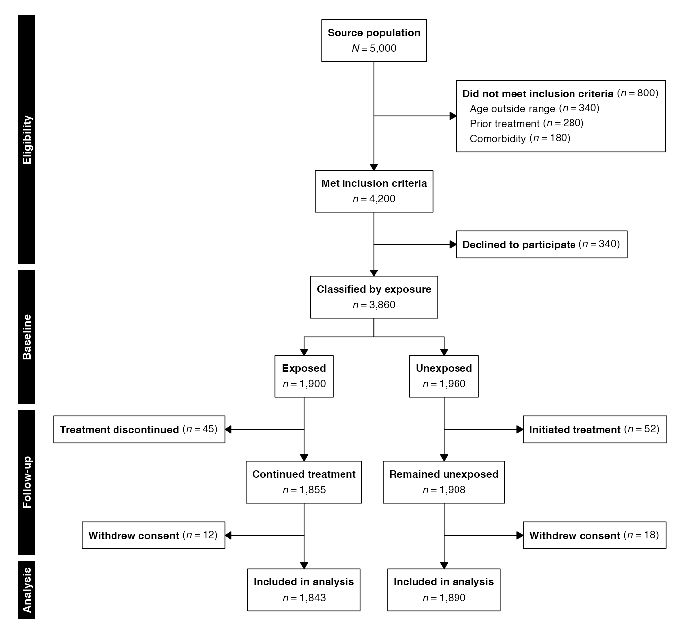

### **Example 9:** Data-Driven Six-Arm Dose-Finding Flow (STROBE)

A six-arm dose-finding trial from the `selectaex6` dataset, using
[`stratify()`](https://phmcc.codeberg.page/selecta/reference/stratify.md)
rather than
[`allocate()`](https://phmcc.codeberg.page/selecta/reference/stratify.md)
since dose-finding studies are not always randomized in the CONSORT
sense.

``` r
flow9 <- enroll(selectaex6, id = "patient_id") |>
    phase("Screening") |>
    exclude("Duplicate records", criterion = is_duplicate == TRUE,
            included_label = "Unique records") |>
    exclude("Failed eligibility", criterion = eligible == FALSE,
            reasons = "exclusion_reason",
            included_label = "Eligible cohort") |>
    phase("Allocation") |>
    stratify("treatment") |>
    phase("Follow-up") |>
    exclude("Discontinued", criterion = discontinued == TRUE,
            reasons = "discontinuation_reason") |>
    phase("Analysis") |>
    endpoint("Analysis cohort")
```

``` r
flowchart(flow9)
```

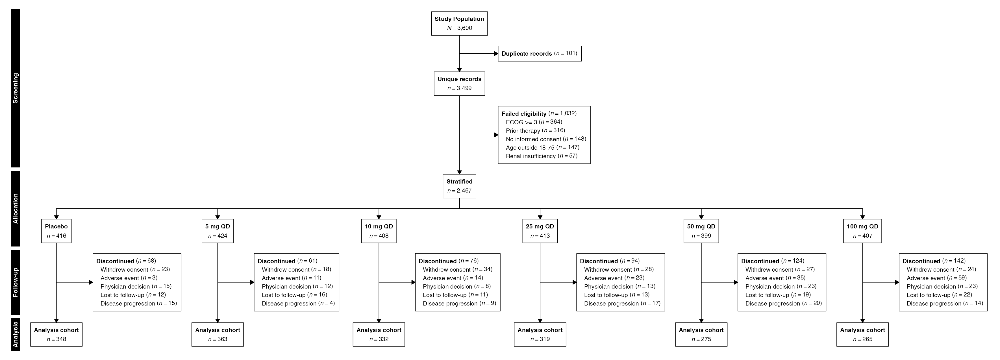

### **Example 10:** Diagnostic Accuracy Study (STARD), Manual

A STARD-style diagnostic accuracy flow using
[`assess()`](https://phmcc.codeberg.page/selecta/reference/assess.md) to
model test receipt and
[`stratify()`](https://phmcc.codeberg.page/selecta/reference/stratify.md)
to split by index test result. Per-arm endpoint breakdowns show the
cross-classification of target condition status within each test result
category.

``` r
flow10 <- enroll(n = 500, label = "Potentially eligible patients") |>
    phase("Enrollment") |>
    exclude("Excluded", n = 40,
            reasons = c("Refused" = 25, "Not meeting criteria" = 15)) |>
    phase("Index") |>
    assess("Index test", not_received = 22,
           reasons = c("Refused" = 12, "Contraindicated" = 10)) |>
    phase("Reference") |>
    assess("Reference standard", not_received = 18,
           reasons = c("Lost to follow-up" = 10, "Inconclusive" = 8)) |>
    phase("Results") |>
    stratify(labels = c("Index test positive", "Index test negative"),
             n = c(180, 240),
             label = "Index test result") |>
    endpoint("Final diagnosis",
             breakdown = list(c("Target condition +" = 160, "Target condition -" = 20),
                            c("Target condition +" = 15, "Target condition -" = 225)))
```

``` r
flowchart(flow10)
```

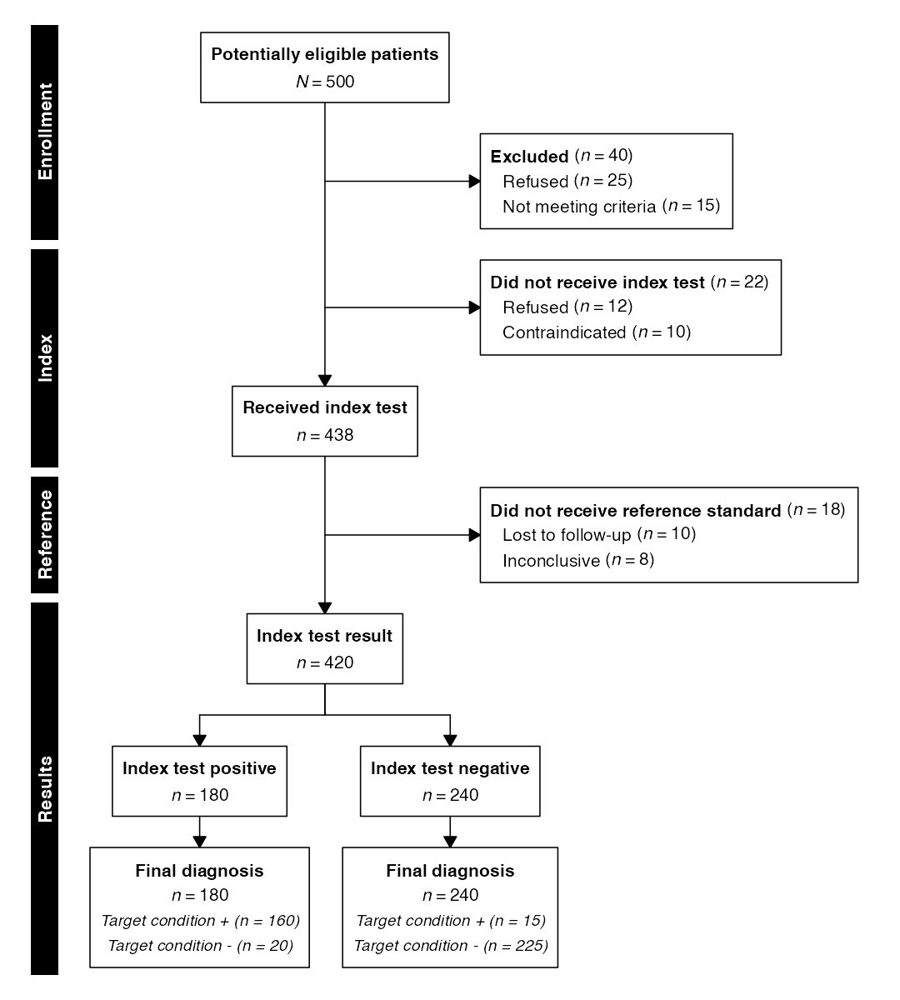

### **Example 11:** Four-Arm Dose-Finding with Layered Exclusions

Parallel arms, an enrollment exclusion with a reason breakdown, a
per-arm follow-up exclusion, and four phase bands combine in one dense
figure. Uniform arm-column widths keep every split and convergence arrow
symmetric regardless of label length:

``` r
flow11 <- enroll(n = 1600, label = "Screened") |>
    phase("Eligibility") |>
    exclude("Ineligible", n = 280,
            reasons = c("Out of range" = 150,
                        "Comorbidity"  = 90,
                        "Other"        = 40),
            included_label = "Randomized") |>
    phase("Allocation") |>
    allocate(labels = c("Placebo", "Low dose", "Mid dose", "High dose"),
             n = c(330, 330, 330, 330)) |>
    phase("Follow-up") |>
    exclude("Discontinued", n = c(20, 18, 22, 25)) |>
    phase("Analysis") |>
    endpoint("Analyzed")
```

``` r
flowchart(flow11,
          cex            = 0.95,
          cex_phase      = 1.0,
          box_fill       = "#fff7ed",
          side_fill      = "#ffedd5",
          border_col     = "#7c2d12",
          arrow_col      = "#9a3412",
          phase_fill     = "#9a3412",
          phase_text_col = "#ffffff")
```

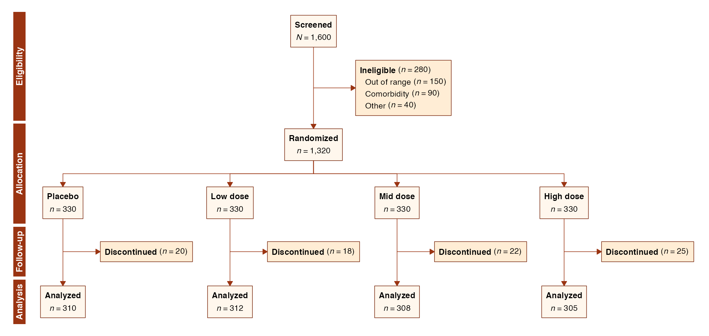

### **Example 12:** Two-by-Two Factorial Trial

A factorial design chains two
[`allocate()`](https://phmcc.codeberg.page/selecta/reference/stratify.md)
steps. The second receives a single count vector enumerating the cells
in parent-major order. A subsequent
[`exclude()`](https://phmcc.codeberg.page/selecta/reference/exclude.md)
takes one count per cell, producing an outboard side box for each leaf
arm:

``` r
flow12 <- enroll(n = 440, label = "Randomized") |>
    phase("Allocation") |>
    allocate(labels = c("Diet program", "Usual diet"), n = c(220, 220),
             label = "Dietary assignment") |>
    allocate(labels = c("Exercise", "No exercise"),
             n = c(110, 110, 110, 110)) |>
    phase("Follow-up") |>
    exclude("Did not begin", n = c(6, 8, 5, 7)) |>
    phase("Analysis") |>
    endpoint("Analyzed")
```

``` r
flowchart(flow12)
```

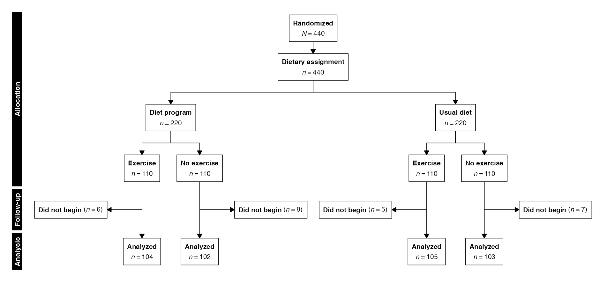

### **Example 13:** Factorial with Recombination and Custom Palette

A factorial allocation may be pooled on its second factor with
[`combine()`](https://phmcc.codeberg.page/selecta/reference/combine.md),
returning the diagram to one stream per first-factor arm. Combined with
multi-phase banding and a coordinated color palette, the result reports
both the crossed allocation and the pooled primary comparison in a
single figure:

``` r
flow13 <- enroll(n = 720, label = "Randomized") |>
    phase("Allocation") |>
    allocate(labels = c("Immediate", "Deferred"), n = c(360, 360),
             label = "Initiation timing") |>
    allocate(labels = c("Monotherapy", "Combination"),
             n = c(180, 180, 180, 180)) |>
    phase("Follow-up") |>
    exclude("Withdrew", n = c(10, 8, 12, 9)) |>
    phase("Pooling") |>
    combine("Pooled by timing") |>
    phase("Analysis") |>
    endpoint("Analyzed")
```

``` r
flowchart(flow13,
          cex            = 0.95,
          cex_phase      = 1.0,
          box_fill       = "#eef4ff",
          side_fill      = "#e3ecfb",
          border_col     = "#1a365d",
          arrow_col      = "#2c5282",
          phase_fill     = "#2c5282",
          phase_text_col = "#ffffff")
```

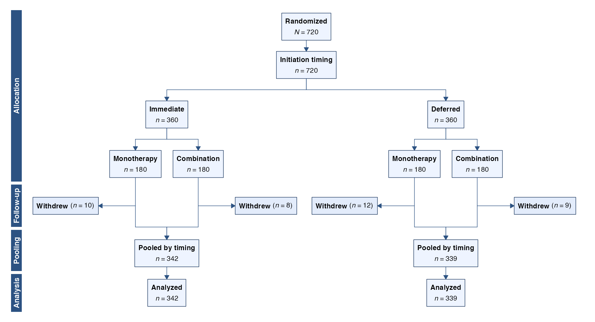

------------------------------------------------------------------------

## Systematic Reviews (PRISMA / MOOSE)

Systematic review diagrams begin with multiple parallel identification
streams created by
[`sources()`](https://phmcc.codeberg.page/selecta/reference/sources.md),
which converge via
[`combine()`](https://phmcc.codeberg.page/selecta/reference/combine.md)
into a single record pool. Subsequent exclusion steps document the
screening cascade. The
[`sources()`](https://phmcc.codeberg.page/selecta/reference/sources.md)
function supports flat lists (single column), grouped sources (multiple
columns with headers), and up to three source groups matching the PRISMA
2020 structure.

### **Example 14:** Single-Column Systematic Review (PRISMA), Manual

A compact PRISMA flow using flat (ungrouped)
[`sources()`](https://phmcc.codeberg.page/selecta/reference/sources.md)
to list all databases in a single column without headers. This is
suitable for smaller reviews where the three-column PRISMA 2020 layout
would be unnecessarily wide.

``` r
flow14 <- sources(PubMed = 1234, Embase = 567, CENTRAL = 89) |>
    phase("Identification") |>
    combine("Records identified") |>
    exclude("Duplicates removed", n = 340,
            included_label = "Records screened") |>
    phase("Screening") |>
    exclude("Records excluded", n = 800,
            reasons = c("Irrelevant title/abstract" = 600,
                        "No full text available" = 200)) |>
    phase("Analysis") |>
    endpoint("Studies included in review")
```

``` r
flowchart(flow14)
```

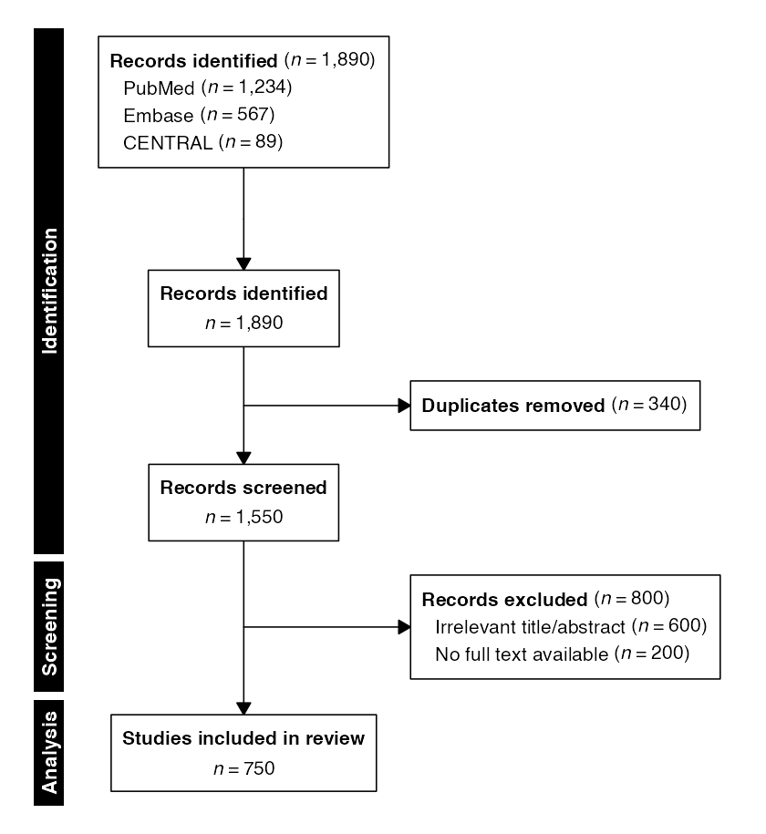

### **Example 15:** Systematic Review (PRISMA 2020), Manual

A full PRISMA 2020 flow diagram with three source columns (previous
studies, databases and registers, and other methods). The
[`sources()`](https://phmcc.codeberg.page/selecta/reference/sources.md)
function creates grouped parallel streams with column headers;
[`combine()`](https://phmcc.codeberg.page/selecta/reference/combine.md)
merges them into a single record pool. Multiple sequential
[`exclude()`](https://phmcc.codeberg.page/selecta/reference/exclude.md)
calls with `show_count = FALSE` stack their side boxes without
intermediate count nodes, matching the PRISMA convention of listing
removal reasons alongside a single screening flow.

``` r
flow15 <- sources(
    previous  = c("Previous review" = 12, "Previous reports" = 15),
    databases = c("PubMed" = 1234, "Embase" = 567, "CENTRAL" = 89),
    other     = c("Citation search" = 55, "Websites" = 34),
    headers   = c(previous  = "Previous studies",
                  databases = "Databases and registers",
                  other     = "Other methods")) |>
    phase("Identification") |>
    combine("Records identified", n = 2006) |>
    exclude("Records removed before screening", n = 352,
            reasons = c("Duplicates" = 340,
                        "Marked ineligible by automation" = 12),
            included_label = "Records screened") |>
    phase("Screening") |>
    exclude("Records excluded after title/abstract screening",
            n = 1100, show_count = FALSE) |>
    exclude("Reports not retrieved", n = 15, show_count = FALSE) |>
    exclude("Reports excluded after full-text review", n = 45,
            reasons = c("Wrong population" = 20,
                        "Wrong outcome" = 15,
                        "Wrong study design" = 10)) |>
    phase("Analysis") |>
    endpoint("Studies included in review")
```

``` r
flowchart(flow15)
```

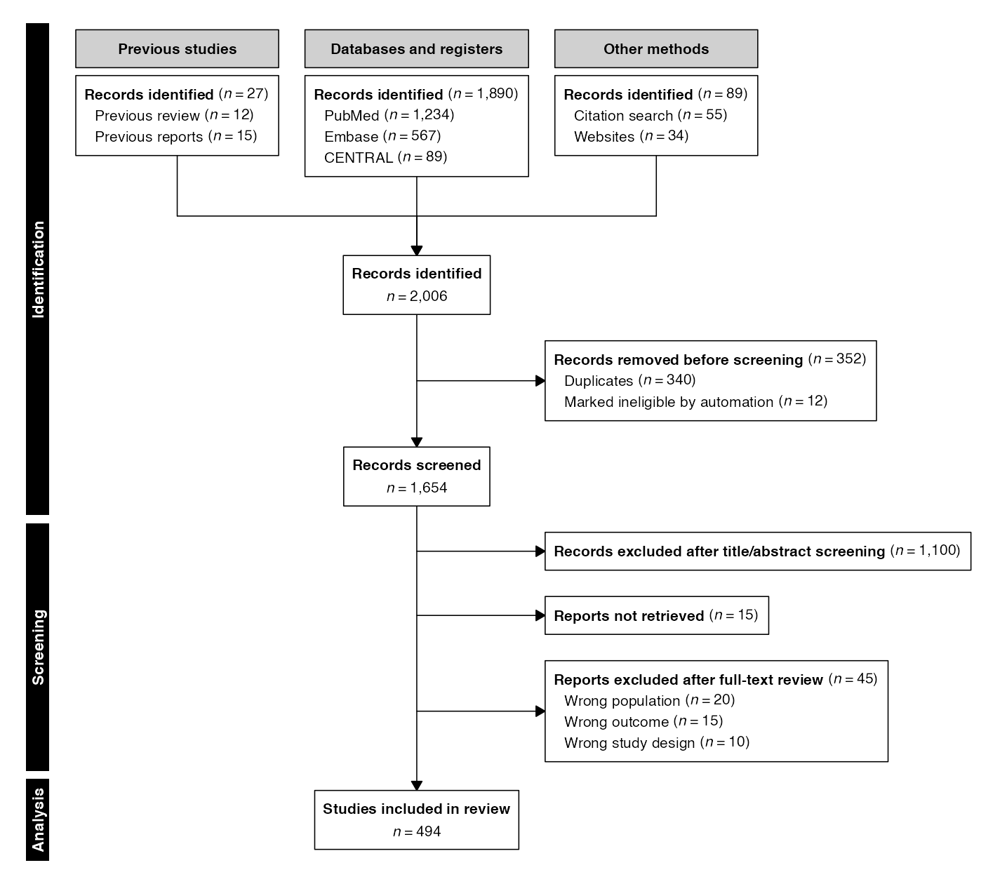

### **Example 16:** Observational Meta-Analysis (MOOSE), Manual, Count-First

A MOOSE-style meta-analysis flow using two source columns (electronic
databases and gray literature). Structurally similar to PRISMA but
typically applied to observational studies. Rendered in count-first mode
to illustrate the alternate label format across multi-source and
single-flow sections.

``` r
flow16 <- sources(
    databases = c("MEDLINE" = 2500, "Embase" = 1800, "PsycINFO" = 400),
    gray      = c("Dissertations" = 45, "Conference proceedings" = 120),
    headers   = c(databases = "Electronic databases",
                  gray      = "Gray literature")) |>
    phase("Identification") |>
    combine("Total records") |>
    exclude("Duplicates removed", n = 1200,
            included_label = "Unique records") |>
    phase("Screening") |>
    exclude("Excluded on title/abstract", n = 2800, show_count = FALSE) |>
    exclude("Excluded on full text", n = 150,
            reasons = c("No control group" = 60,
                        "Insufficient data" = 50,
                        "Wrong population" = 40)) |>
    phase("Analysis") |>
    endpoint("Studies in meta-analysis")
```

``` r
flowchart(flow16, count_first = TRUE)
```

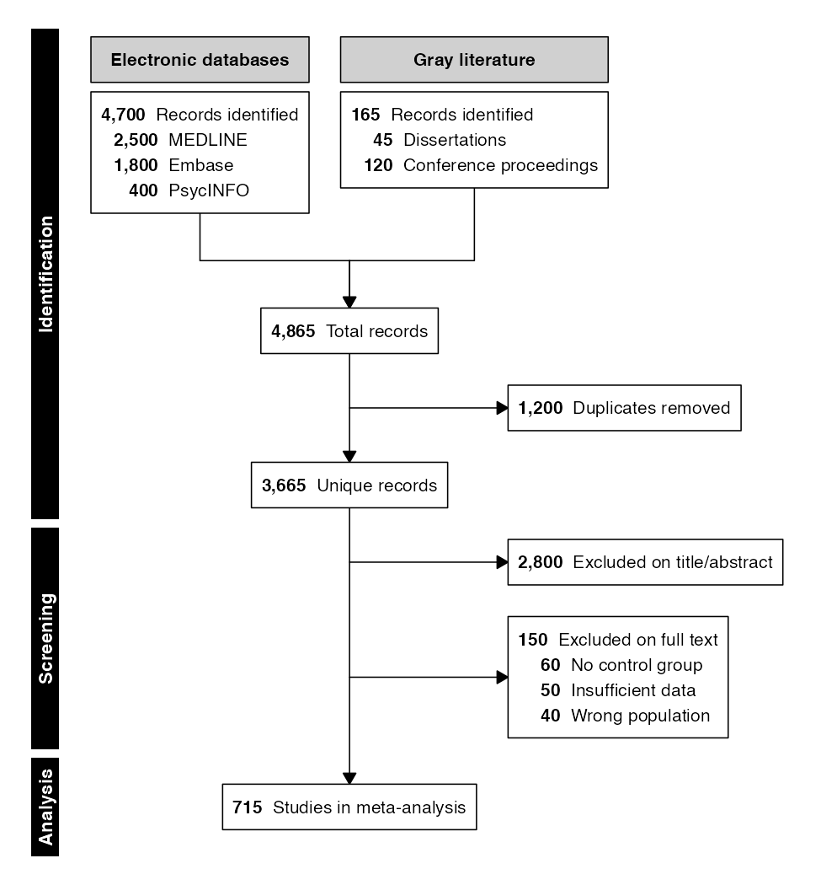

------------------------------------------------------------------------

## Split-and-Recombine Diagrams

Split-and-recombine diagrams use
[`stratify()`](https://phmcc.codeberg.page/selecta/reference/stratify.md)
to divide a population into strata that are characterized independently,
then
[`combine()`](https://phmcc.codeberg.page/selecta/reference/combine.md)
to merge the strata back into a single downstream flow. This topology is
distinct from both permanent allocation (CONSORT, where arms proceed to
separate endpoints) and top-level source convergence (PRISMA, where
streams merge at entry).

### **Example 17:** Split-and-Recombine Screening Flow, Manual

A population is stratified by screening modality, characterized
independently within each stratum, and then recombined into a unified
downstream cohort for further analysis. The `sublabel` parameter adds a
descriptive line below the recombined box heading.

``` r
flow17 <- enroll(n = 160,
                label = "High-risk participants") |>
    phase("Enrollment") |>
    exclude("Concurrent enrollment in another study", n = 2,
            included_label = "Total cohort") |>
    phase("Screening Status") |>
    stratify(
        labels = c("Unscreened", "Screened"),
        n = c(82, 76),
        label = "Annual screening status"
    ) |>
    exclude("Without confirmed outcome", n = c(44, 66)) |>
    combine("Outcome cohort",
            sublabel = "Participants with confirmed outcome") |>
    phase("Outcome Verification") |>
    exclude("Without available adjudication", n = 7) |>
    exclude("Without available imaging", n = 23) |>
    endpoint("Participants with available imaging")
```

``` r
flowchart(flow17)
```


### **Example 18:** Exposure Cohort with Recombination (STROBE), Count-First

An observational cohort is classified by statin exposure, per-stratum
attrition is documented with sub-reasons, and the strata are recombined
for the primary analysis. This demonstrates the split-and-recombine
pattern in a pharmacoepidemiological context.

``` r
flow18 <- enroll(n = 5000, label = "Patients in registry") |>
    phase("Enrollment") |>
    exclude("Ineligible", n = 800,
            reasons = c("Age < 18" = 200,
                        "Prior diagnosis" = 350,
                        "Missing baseline data" = 250),
            included_label = "Eligible cohort") |>
    phase("Exposure Classification") |>
    stratify(
        labels = c("Statin users", "Non-users"),
        n = c(1800, 2400),
        label = "Classified by statin exposure"
    ) |>
    exclude("Lost to follow-up", n = c(120, 180),
            reasons = list(
                c("Moved" = 50, "Withdrew consent" = 40, "Deceased" = 30),
                c("Moved" = 80, "Withdrew consent" = 60, "Deceased" = 40)
            )) |>
    combine("Analysis cohort",
            sublabel = "Patients with complete follow-up") |>
    phase("Analysis") |>
    endpoint("Included in primary analysis")
```

``` r
flowchart(flow18, count_first = TRUE)
```

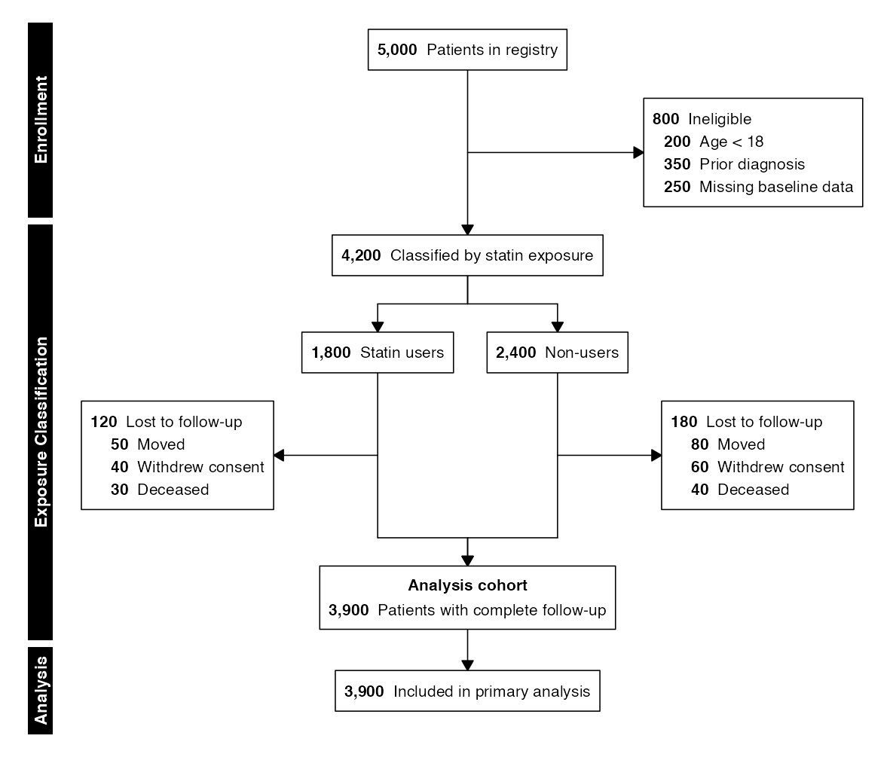

### **Example 19:** Risk Stratification, Recombination, and Randomization

An adaptive design where patients are stratified by baseline risk,
recombined after characterization, and then randomized, demonstrating
re-splitting after a prior
[`combine()`](https://phmcc.codeberg.page/selecta/reference/combine.md).
The layout engine correctly scopes each split-combine span so that the
converge arrows for the first split do not interfere with the second
split’s arm layout.

``` r
flow19 <- enroll(n = 2000, label = "Screened") |>
    phase("Screening") |>
    exclude("Ineligible", n = 400,
            reasons = c("No consent" = 180, "Prior treatment" = 120,
                        "ECOG >= 3" = 100)) |>
    phase("Risk Stratification") |>
    stratify(
        labels = c("High risk", "Low risk"),
        n = c(700, 900),
        label = "Risk classification"
    ) |>
    exclude("Declined participation", n = c(50, 80)) |>
    combine("Eligible cohort") |>
    phase("Allocation") |>
    allocate(labels = c("Intervention", "Control"),
             n = c(735, 735)) |>
    phase("Follow-up") |>
    exclude("Lost to follow-up", n = c(30, 35),
            reasons = list(
                c("Withdrew consent" = 18, "Relocated" = 12),
                c("Withdrew consent" = 20, "Relocated" = 15)
            )) |>
    phase("Analysis") |>
    endpoint("Analyzed")
```

``` r
flowchart(flow19)
```


------------------------------------------------------------------------

## Hybrid Topologies

These diagrams combine multiple flow patterns in a single pipeline. For
example, multi-site source convergence followed by randomization, or
combinations that would not fit neatly into any single EQUATOR
guideline.

### **Example 20:** Multicenter Study with Randomization, Manual

A hybrid design combining multi-source entry with downstream
randomization. Three study sites are pooled via
[`sources()`](https://phmcc.codeberg.page/selecta/reference/sources.md)
and
[`combine()`](https://phmcc.codeberg.page/selecta/reference/combine.md),
screening failures are documented with sub-reasons, and the remaining
cohort is randomized into two arms with per-arm discontinuation reasons
supplied as a list of named vectors.

``` r
flow20 <- sources(
    site_a = c("Site A" = 300),
    site_b = c("Site B" = 250),
    site_c = c("Site C" = 200),
    headers = c(site_a = "Site A", site_b = "Site B", site_c = "Site C")) |>
    phase("Enrollment") |>
    combine("Pooled cohort") |>
    exclude("Screening failures", n = 150,
            reasons = c("Lab values" = 80, "EKG abnormal" = 40,
                        "Withdrew consent" = 30)) |>
    phase("Allocation") |>
    allocate(labels = c("Treatment", "Control"), n = c(300, 300)) |>
    phase("Follow-up") |>
    exclude("Discontinued", n = c(15, 12),
            reasons = list(
                c("Deceased" = 8, "Lost to follow-up" = 7),
                c("Deceased" = 6, "Lost to follow-up" = 6)
            )) |>
    phase("Analysis") |>
    endpoint("Primary analysis")
```

``` r
flowchart(flow20)
```

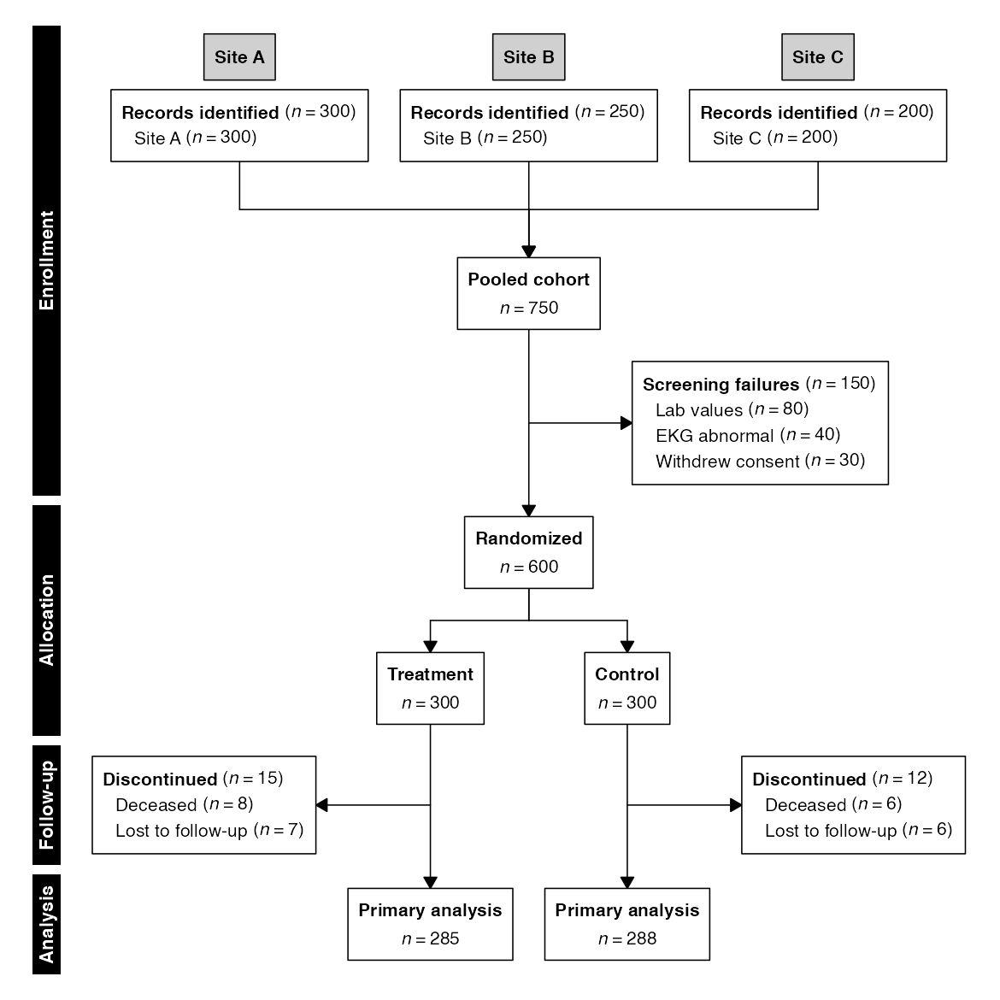

------------------------------------------------------------------------

## Typography and Number Formatting

The preceding examples use the default Helvetica typeface and United
States number formatting. The `grid` engine exposes both as parameters
of
[`flowchart()`](https://phmcc.codeberg.page/selecta/reference/flowchart.md)
(and, identically, of
[`flowsave()`](https://phmcc.codeberg.page/selecta/reference/flowsave.md)),
allowing the diagram to match the typographic and locale conventions of
the surrounding document. Box dimensions are recomputed from the metrics
of the selected font, so the layout adapts automatically; no manual
resizing is required.

### **Example 21:** Serif Typeface, Manual

A single-flow genomic biobank cohort rendered in a serif typeface via
`font_family = "serif"`. Serif faces suit manuscripts typeset in a serif
body font, and the generic family name resolves to an appropriate face
on every platform. This example also illustrates quality-control
attrition, in which samples are removed for technical rather than
clinical reasons.

``` r
flow21 <- enroll(n = 8400, label = "Biobank participants") |>
    phase("Eligibility") |>
    exclude("Ineligible for analysis", n = 1560,
            reasons = c("Insufficient sample volume" = 720,
                        "Missing consent records" = 540,
                        "Genotyping failure" = 300),
            included_label = "Analyzable samples") |>
    phase("Quality control") |>
    exclude("Failed quality control", n = 340,
            reasons = c("Call rate below threshold" = 190,
                        "Sex mismatch" = 90,
                        "Cryptic relatedness" = 60),
            included_label = "Passed quality control") |>
    phase("Analysis") |>
    endpoint("Analytic cohort")
```

``` r
flowchart(flow21, font_family = "serif")
```

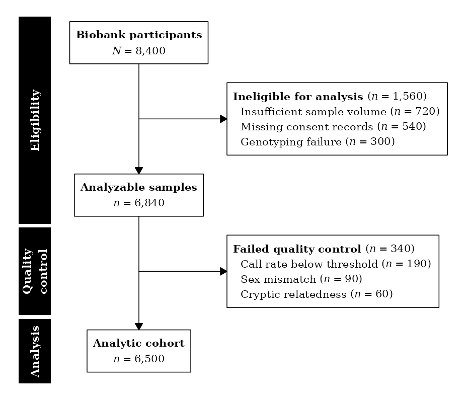

### **Example 22:** Monospace Typeface, Manual

A two-arm pilot trial rendered in a monospace typeface via
`font_family = "mono"`. Because every glyph in a monospace font occupies
the same width, digits align into clean vertical columns—a property
occasionally desired for technical reports or supplementary materials.
Any installed system font may be named in place of the generic families.

``` r
flow22 <- enroll(n = 240, label = "Screened for pilot study") |>
    phase("Enrollment") |>
    exclude("Excluded", n = 48,
            reasons = c("Declined to participate" = 28,
                        "Did not meet criteria" = 20),
            included_label = "Enrolled") |>
    phase("Allocation") |>
    allocate(labels = c("App-based intervention", "Usual care"),
             n = c(96, 96)) |>
    phase("Analysis") |>
    endpoint("Completed pilot")
```

``` r
flowchart(flow22, font_family = "mono")
```

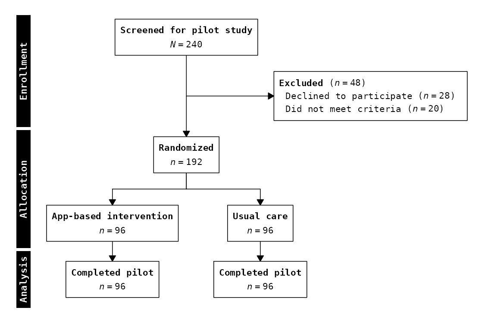

### **Example 23:** Multi-Line Phase Labels, Manual

A three-arm environmental cohort whose phase labels carry full
descriptive sentences. Because phase labels wrap by default, each
rotated label is laid across several stacked lines so that a long
description occupies additional strip width rather than forcing the
diagram taller; the `phase_max_lines` argument bounds the wrap depth,
and `phase_multiline = FALSE` disables wrapping entirely. A line break
may alternatively be placed by hand with the newline character `"\n"`,
which is honored irrespective of this setting.

``` r
flow23 <- enroll(n = 5200, label = "Cohort members") |>
    phase("Baseline enrollment and exposure assessment") |>
    exclude("Excluded at baseline", n = 700,
            reasons = c("Incomplete exposure history" = 360,
                        "Prevalent disease" = 220,
                        "Missing covariates" = 120),
            included_label = "Eligible for follow-up") |>
    phase("Stratification by exposure tertile") |>
    stratify(labels = c("Low exposure", "Moderate exposure",
                        "High exposure"),
             n = c(1500, 1500, 1500),
             label = "Exposure tertile") |>
    phase("Longitudinal outcome ascertainment") |>
    exclude("Lost to follow-up", n = c(120, 140, 160)) |>
    phase("Analysis") |>
    endpoint("Analytic sample")
```

``` r
flowchart(flow23)
```

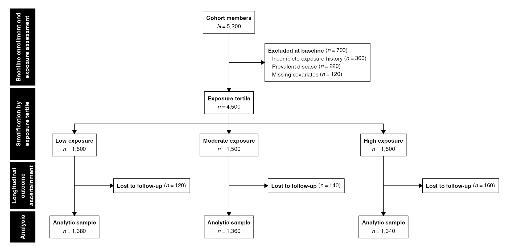

### **Example 24:** European Number Formatting, Manual

A national screening program with counts in the hundreds of thousands,
formatted with the European preset via `number_format = "eu"` (period
thousands separator, comma decimal). The preset accepts `"us"`, `"eu"`,
`"space"` (the SI/ISO thin space), and `"none"`, or a custom
`c(big.mark, decimal.mark)` pair; a session-wide default may be set
through `options(selecta.number_format)`.

``` r
flow24 <- enroll(n = 1284500, label = "Invited to screening") |>
    phase("Participation") |>
    exclude("Did not attend", n = 458200,
            included_label = "Attended screening") |>
    exclude("Inadequate sample", n = 32600,
            reasons = c("Sample insufficient" = 21400,
                        "Technical failure" = 11200),
            included_label = "Valid result") |>
    phase("Outcome") |>
    endpoint("Entered surveillance")
```

``` r
flowchart(flow24, number_format = "eu")
```

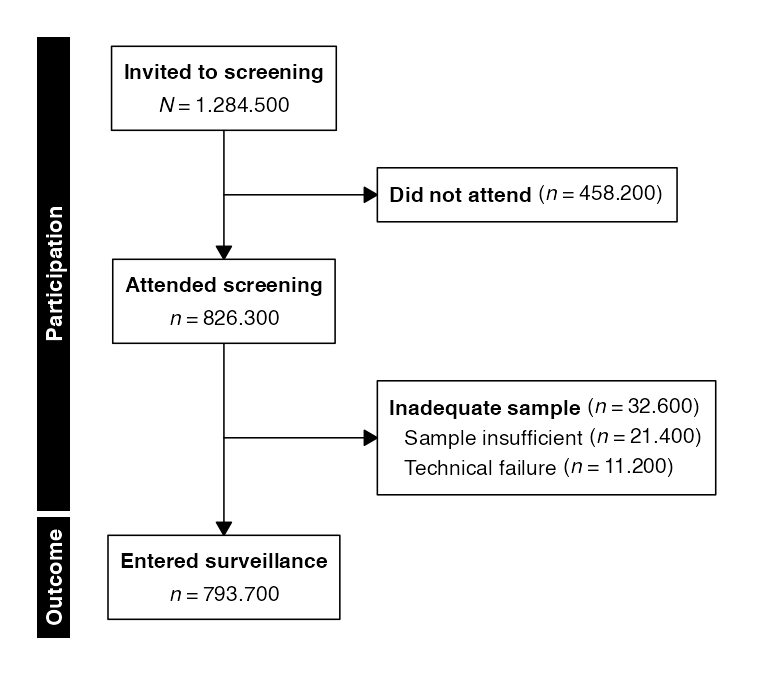

------------------------------------------------------------------------

## Graphviz / DOT Outputs

The DOT engine produces a Graphviz-language description of the diagram,
suitable for rendering through the system `dot` binary, the `DiagrammeR`
R package, or any other Graphviz-compatible tool. The examples below use
the same source pipelines as elsewhere in the gallery but pass
`engine = "dot"` to
[`flowchart()`](https://phmcc.codeberg.page/selecta/reference/flowchart.md)
to obtain the alternate layout. See the [Graphviz
Export](https://phmcc.codeberg.page/selecta/articles/graphviz_export.md)
vignette for a full discussion of customization, fallback behavior, and
the orthogonal-edge option.

### **Example 25:** Two-Arm CONSORT (DOT)

The default DOT output uses Graphviz’s orthogonal spline routing. Colors
match the grid engine: main flow boxes are white, phase label boxes are
black, and source column header boxes are gray.

``` r
flow25 <- enroll(n = 1200, label = "Assessed for eligibility") |>
    phase("Enrollment") |>
    exclude("Excluded", n = 300,
            reasons = c("Not meeting criteria" = 160,
                        "Declined" = 90, "Other" = 50)) |>
    phase("Allocation") |>
    allocate(labels = c("Drug A", "Placebo"), n = c(450, 450)) |>
    phase("Follow-up") |>
    exclude("Lost to follow-up", n = c(20, 20)) |>
    phase("Analysis") |>
    endpoint("Analyzed")

dot25 <- flowchart(flow25, engine = "dot")
```

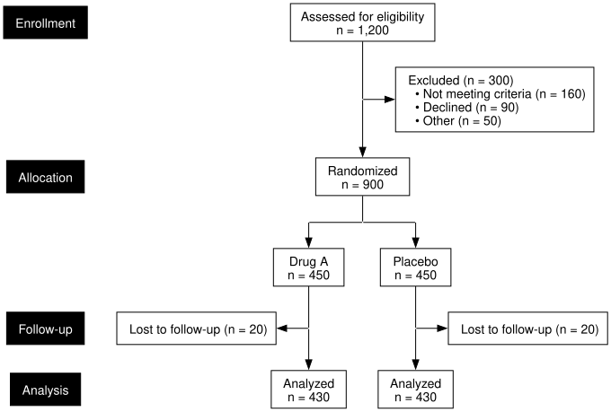

### **Example 26:** Multi-Source PRISMA (DOT)

Converging multi-source diagrams can also be rendered via the DOT
engine. Each source column is laid out independently at the top of the
graph with its header centered above the column, and
[`combine()`](https://phmcc.codeberg.page/selecta/reference/combine.md)
produces a fan-in to the identified cohort.

``` r
flow26 <- sources(
        previous  = c("Previous review" = 12, "Previous reports" = 15),
        databases = c("PubMed" = 1234, "Embase" = 567, "CENTRAL" = 89),
        other     = c("Citation search" = 55, "Websites" = 34),
        headers   = c(previous  = "Previous studies",
                      databases = "Databases and registers",
                      other     = "Other methods")) |>
    combine("Records identified", n = 2006) |>
    exclude("Duplicates removed", n = 352,
            included_label = "Records screened") |>
    exclude("Records excluded", n = 1100) |>
    endpoint("Studies included in review")

dot26 <- flowchart(flow26, engine = "dot", ortho = TRUE)
```


### **Example 27:** Count-First CONSORT (DOT)

The `count_first = TRUE` option, familiar from the grid engine, is also
honored by the DOT engine. The count precedes the label text on a single
line, producing a compact layout. Counts render with the locale-aware
separator selected via `number_format`.

``` r
dot27 <- flowchart(flow25, engine = "dot", count_first = TRUE)
```

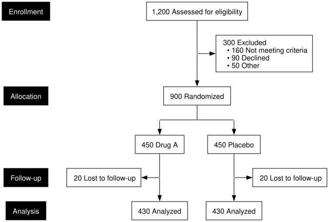

### **Example 28:** Times Typography (DOT)

The DOT engine defaults to Helvetica, but accepts any Graphviz-supported
font via `font_family`. Times-Roman is appropriate when Helvetica is
unavailable, when serif typography fits the surrounding document, or
when consistency with PDF output matters more than visual parity with
the grid engine. Pair with `sans_serif = FALSE` on `render_dot()` to
retain the Times typography rather than substituting it for the
cross-platform sans-serif chain:

``` r
dot28 <- flowchart(flow25, engine = "dot",
                   font_family = "Times-Roman")
```

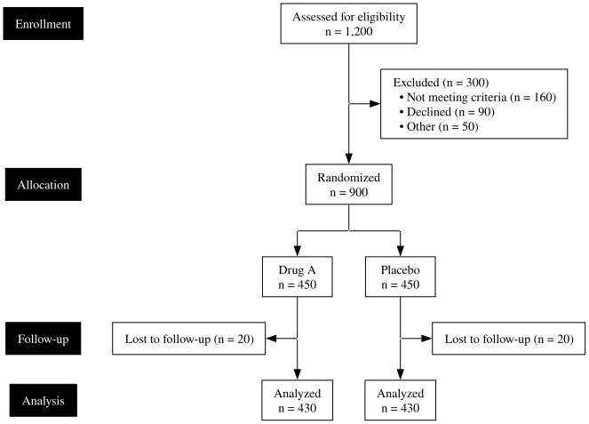

### **Example 29:** Rich Formatting (DOT)

The DOT engine emits plain-text labels by default, which Graphviz
centers reliably across all fonts. For diagrams where inline italic *n*
and inline bold descriptive text matter — the typographic conventions
used by the grid engine and by published EQUATOR diagrams —
`formatting = "rich"` switches to HTML-like labels:

``` r
dot29 <- flowchart(flow25, engine = "dot", formatting = "rich")
```

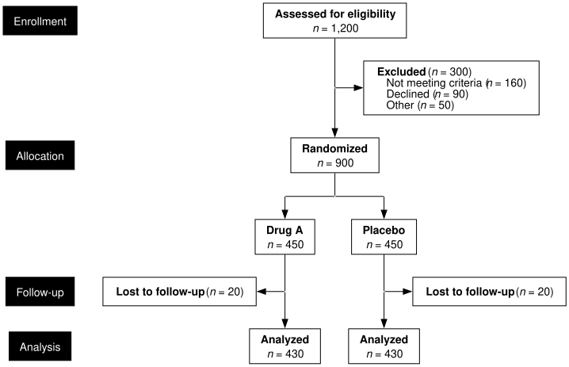

Rich formatting uses Graphviz’s HTML-label code path, which has slight
text-width estimation drift for bold strings. The DOT engine compensates
with embedded Adobe Font Metric tables and a trailing-whitespace
centering correction for Helvetica and Times, producing
sub-pixel-accurate centering. The plain default (Examples 25-28) is
recommended for prototyping and web embedding; the rich variant (this
example) is recommended when inline typographic emphasis is essential.
See the [Graphviz
Export](https://phmcc.codeberg.page/selecta/articles/graphviz_export.md)
vignette for further discussion.

### **Example 30:** Two-by-Two Factorial Trial (DOT)

The DOT engine renders the factorial layout with the same nesting,
displaying each parent over its sub-arm pair and splaying the per-cell
exclusion boxes outward. The flow object from the grid factorial above
is reused unchanged:

``` r
dot30 <- flowchart(flow12, engine = "dot")
```

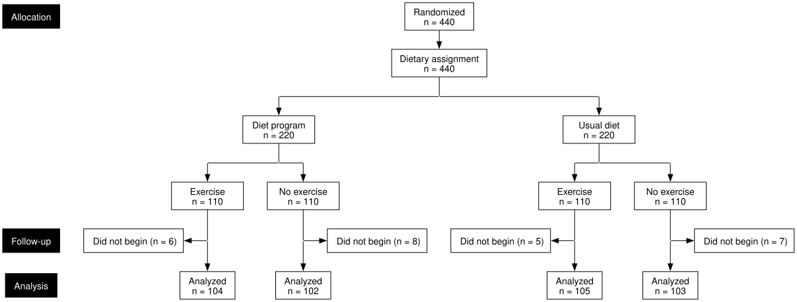

### **Example 31:** Hierarchical Exclusion Reasons (DOT)

The DOT engine renders the two-level reason breakdown with bulleted
parents and en-dashed sub-reasons inside the exclusion node.

``` r
dot31 <- flowchart(flow4, engine = "dot")
```

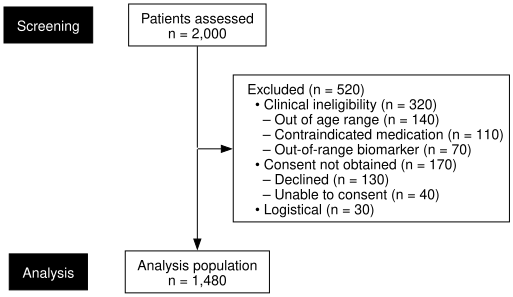

If bullets are not desired, setting `bullets = FALSE` removes the
markers in favor of indentation alone.

### **Example 32:** Multi-Source PRISMA with Nested Reasons (DOT)

Top-level source convergence, a multi-stage screening cascade, a
hierarchical full-text exclusion breakdown, and orthogonal edge routing
combine in one diagram. The DOT engine resolves the source columns, the
nested reason box, and the right-angle channel together:

``` r
flow_src_nested <- sources(
        databases = c("PubMed" = 1620, "Embase" = 940, "Scopus" = 510),
        other     = c("Citation chasing" = 70, "Trial registries" = 35),
        headers   = c(databases = "Databases", other = "Other sources")) |>
    phase("Identification") |>
    combine("Records identified") |>
    exclude("Duplicates removed", n = 540,
            included_label = "Records screened") |>
    phase("Screening") |>
    exclude("Excluded by title and abstract", n = 2110,
            included_label = "Reports assessed") |>
    phase("Eligibility") |>
    exclude("Reports excluded", n = 380,
            reasons = list(
                "Ineligible design" = c("Case report" = 90,
                                        "Review"      = 70,
                                        "Editorial"   = 25),
                "Out of scope" = c("Wrong population" = 80,
                                   "Wrong outcome"    = 55),
                "No usable data" = 60)) |>
    phase("Included") |>
    endpoint("Studies in synthesis")

dot32 <- flowchart(flow_src_nested, engine = "dot", ortho = TRUE)
```

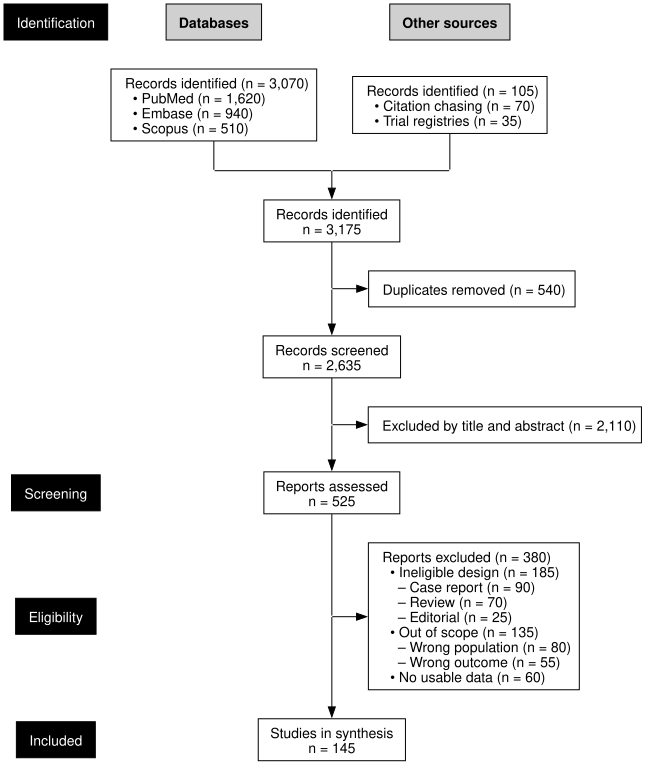

### **Example 33:** Factorial with Orthogonal Times Typography (DOT)

A factorial layout under the DOT engine, combining orthogonal routing,
the count-first label format, and Times-Roman typography. Rendering with
`sans_serif = FALSE` retains the serif face rather than substituting the
cross-platform sans-serif chain:

``` r
flow_fac_ortho <- enroll(n = 800, label = "Randomized") |>
    phase("Allocation") |>
    allocate(labels = c("Arm A", "Arm B"), n = c(400, 400),
             label = "Primary factor") |>
    allocate(labels = c("Adjunct", "Standard"),
             n = c(200, 200, 200, 200)) |>
    phase("Follow-up") |>
    exclude("No treatment", n = c(6, 9, 7, 8)) |>
    phase("Analysis") |>
    endpoint("Analyzed")

dot33 <- flowchart(flow_fac_ortho, engine = "dot", ortho = TRUE,
                   count_first = TRUE, font_family = "Times-Roman")
```

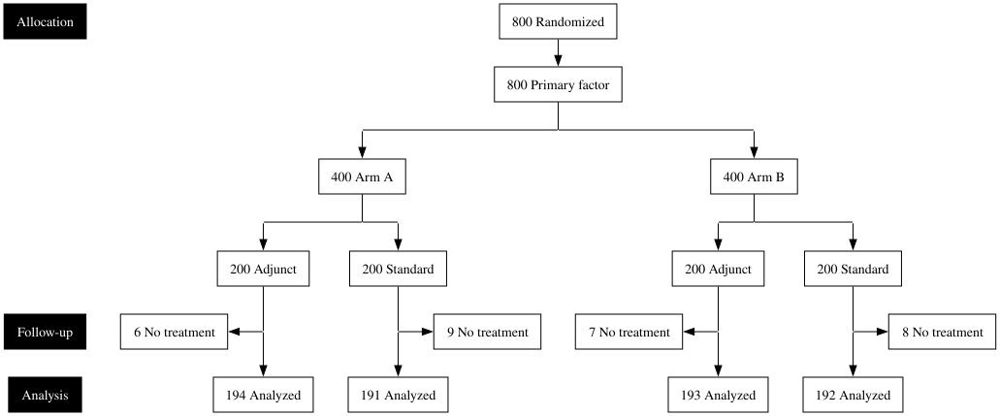

------------------------------------------------------------------------

## Further Reading

- [Enrollment
  Diagrams](https://phmcc.codeberg.page/selecta/articles/enrollment_diagrams.md):
  CONSORT, STROBE, and STARD diagrams with permanent parallel arms
- [Systematic
  Reviews](https://phmcc.codeberg.page/selecta/articles/systematic_reviews.md):
  PRISMA and MOOSE diagrams with top-level source convergence
- [Split-and-Recombine
  Diagrams](https://phmcc.codeberg.page/selecta/articles/split_recombine.md):
  Hybrid topologies for screening validation and exposure classification
- [Advanced
  Workflows](https://phmcc.codeberg.page/selecta/articles/advanced_workflows.md):
  Factorial (nested-split) designs and hierarchical exclusion reasons
- [Graphviz
  Export](https://phmcc.codeberg.page/selecta/articles/graphviz_export.md):
  DOT output for Graphviz/DiagrammeR rendering
