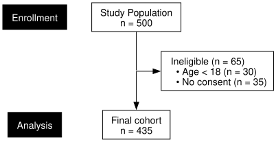
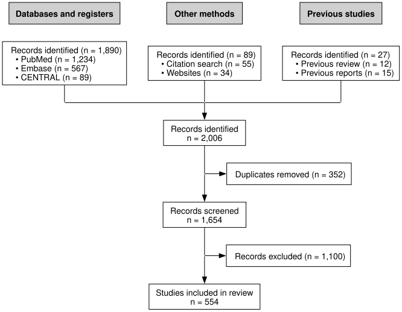
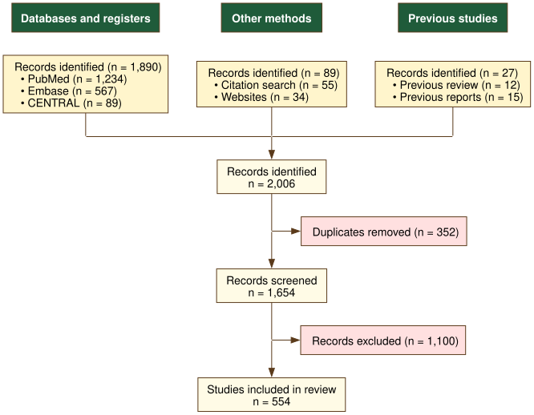
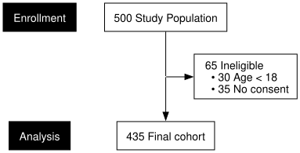
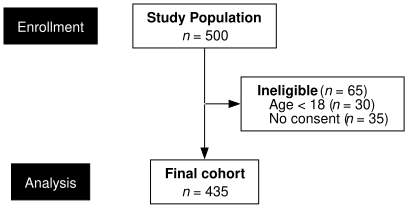
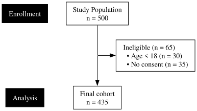
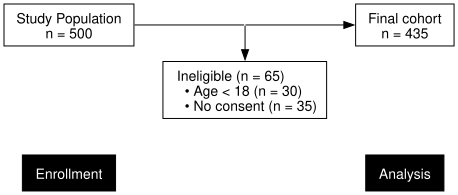

# Graphviz Export

The default rendering engine in `selecta` uses R’s `grid` graphics
system to produce publication-quality PDF, PNG, SVG, and TIFF output.
For applications requiring web embedding or integration with
graph-manipulation tools, `selecta` also supports export to the Graphviz
DOT language. The resulting DOT strings can be rendered with the
[`DiagrammeR`](https://rich-iannone.github.io/DiagrammeR/) package or
any Graphviz-compatible tool.

> *n.b.:* The diagrams in this vignette are rendered through the system
> Graphviz binary (`dot`) when available, providing reliable support for
> all Graphviz attributes (including `splines=ortho` for right-angle
> edges). When the binary is not available, the vignette falls back to
> [`DiagrammeR::grViz()`](https://rich-iannone.github.io/DiagrammeR/reference/grViz.html),
> which produces embeddable HTML widgets but may silently drop some
> Graphviz directives.

------------------------------------------------------------------------

## Preliminaries

``` r
library(selecta)
```

The DOT engine is available through the `engine` argument of
[`flowchart()`](https://phmcc.codeberg.page/selecta/reference/flowchart.md)
and [`plot()`](https://rdrr.io/r/graphics/plot.default.html). No
additional packages are required to generate DOT strings; however,
rendering them as an HTML widget requires `DiagrammeR`:

``` r
library(DiagrammeR)
```

------------------------------------------------------------------------

## Generating DOT Output

### **Example 1:** Basic DOT String

The `engine = "dot"` argument causes
[`flowchart()`](https://phmcc.codeberg.page/selecta/reference/flowchart.md)
to return a character string in the Graphviz DOT language rather than
drawing to a graphics device:

``` r
example1 <- enroll(n = 500) |>
    phase("Enrollment") |>
    exclude("Ineligible", n = 65,
            reasons = c("Age < 18" = 30, "No consent" = 35),
            included_label = "Eligible") |>
    phase("Analysis") |>
    endpoint("Final cohort")

dot_str <- flowchart(example1, engine = "dot")
dot_str
#> [1] "digraph selecta {\n  rankdir=TB;\n  splines=ortho;\n  concentrate=false;\n  nodesep=0.500;\n  ranksep=0.400;\n  node [shape=box, style=filled, fontname=\"Helvetica\", fontsize=14, margin=\"0.194,0.083\", color=\"black\"];\n  PL1 [label=\"Enrollment\", shape=box, style=\"filled\", fillcolor=\"#000000\", fontcolor=\"#FFFFFF\", color=\"#000000\", group=\"phase_labels\"];\n  PL2 [label=\"Analysis\", shape=box, style=\"filled\", fillcolor=\"#000000\", fontcolor=\"#FFFFFF\", color=\"#000000\", group=\"phase_labels\"];\n  PL1 -> PL2 [style=invis, weight=100];\n  n1 [label=\"Study Population\\nn = 500\", fillcolor=\"#FFFFFF\", group=\"trunk\"];\n  n2 [label=\"Ineligible (n = 65)\\l  • Age < 18 (n = 30)\\l  • No consent (n = 35)\\l\", fillcolor=\"#FFFFFF\"];\n  n3 [label=\"Final cohort\\nn = 435\", fillcolor=\"#FFFFFF\", group=\"trunk\"];\n  P1 [shape=point, width=0, style=invis] [group=\"trunk\"];\n  n1 -> P1 [arrowhead=none, color=\"black\"];\n  P1 -> n2 [color=\"black\"];\n  subgraph { rank=same; rankdir=LR; P1; n2; }\n  P1 -> n3 [color=\"black\"];\n  subgraph { rank=same; rankdir=LR; PL1; n1; }\n  subgraph { rank=same; rankdir=LR; PL2; n3; }\n}"
```



The DOT string defines a directed graph (`digraph`) with one node per
diagram box and one edge per flow or exclusion arrow.

### **Example 2:** Multi-Arm Trial (CONSORT)

The DOT engine supports more complex split diagram types, including
multi-arm trials with per-arm exclusions:

``` r
example2 <- enroll(n = 1200, label = "Assessed for eligibility") |>
    phase("Enrollment") |>
    exclude("Excluded", n = 300,
            reasons = c("Not meeting criteria" = 160,
                        "Declined" = 90, "Other" = 50)) |>
    phase("Allocation") |>
    allocate(labels = c("Drug A", "Placebo"), n = c(450, 450)) |>
    phase("Follow-up") |>
    exclude("Lost to follow-up", n = c(20, 20)) |>
    phase("Analysis") |>
    endpoint("Analyzed")

dot_2arm <- flowchart(example2, engine = "dot")
cat(dot_2arm)
#> digraph selecta {
#>   rankdir=TB;
#>   splines=ortho;
#>   concentrate=false;
#>   nodesep=0.500;
#>   ranksep=0.400;
#>   node [shape=box, style=filled, fontname="Helvetica", fontsize=14, margin="0.194,0.083", color="black"];
#>   PL1 [label="Enrollment", shape=box, style="filled", fillcolor="#000000", fontcolor="#FFFFFF", color="#000000", group="phase_labels"];
#>   PL2 [label="Allocation", shape=box, style="filled", fillcolor="#000000", fontcolor="#FFFFFF", color="#000000", group="phase_labels"];
#>   PL3 [label="Follow-up", shape=box, style="filled", fillcolor="#000000", fontcolor="#FFFFFF", color="#000000", group="phase_labels"];
#>   PL4 [label="Analysis", shape=box, style="filled", fillcolor="#000000", fontcolor="#FFFFFF", color="#000000", group="phase_labels"];
#>   PL1 -> PL2 [style=invis, weight=100];
#>   PL2 -> PL3 [style=invis, weight=100];
#>   PL3 -> PL4 [style=invis, weight=100];
#>   n1 [label="Assessed for eligibility\nn = 1,200", fillcolor="#FFFFFF", group="trunk"];
#>   n2 [label="Excluded (n = 300)\l  • Not meeting criteria (n = 160)\l  • Declined (n = 90)\l  • Other (n = 50)\l", fillcolor="#FFFFFF"];
#>   n3 [label="Randomized\nn = 900", fillcolor="#FFFFFF", group="trunk"];
#>   n4 [label="Drug A\nn = 450", fillcolor="#FFFFFF", width=1.091, group="arm_1"];
#>   n5 [label="Placebo\nn = 450", fillcolor="#FFFFFF", width=1.091, group="arm_2"];
#>   n6 [label="Lost to follow-up (n = 20)\l", fillcolor="#FFFFFF"];
#>   n7 [label="Lost to follow-up (n = 20)\l", fillcolor="#FFFFFF"];
#>   n8 [label="Analyzed\nn = 430", fillcolor="#FFFFFF", group="arm_1"];
#>   n9 [label="Analyzed\nn = 430", fillcolor="#FFFFFF", group="arm_2"];
#>   P1 [shape=point, width=0, style=invis] [group="arm_1"];
#>   P2 [shape=point, width=0, style=invis] [group="arm_2"];
#>   n4 -> P1 [arrowhead=none, color="black", weight=100];
#>   P1 -> n8 [color="black", weight=100];
#>   n5 -> P2 [arrowhead=none, color="black", weight=100];
#>   P2 -> n9 [color="black", weight=100];
#>   n6 -> P1 [dir=back, color="black"];
#>   P2 -> n7 [color="black"];
#>   P1 -> P2 [style=invis];
#>   subgraph { rank=same; rankdir=LR; n6; P1; P2; n7; }
#>   P3 [shape=point, width=0, style=invis] [group="trunk"];
#>   n1 -> P3 [arrowhead=none, color="black"];
#>   P3 -> n2 [color="black"];
#>   subgraph { rank=same; rankdir=LR; P3; n2; }
#>   P3 -> n3 [color="black"];
#>   P4 [shape=point, width=0, style=invis] [group="arm_1"];
#>   P5 [shape=point, width=0, style=invis] [group="arm_2"];
#>   P6 [shape=point, width=0, style=invis] [group="trunk"];
#>   P4 -> P6 -> P5 [arrowhead=none, color="black"];
#>   n3 -> P6 [arrowhead=none, color="black", weight=20];
#>   P4 -> n4 [color="black"];
#>   P5 -> n5 [color="black"];
#>   subgraph { rank=same; rankdir=LR; P4; P6; P5; }
#>   subgraph { rank=same; rankdir=LR; PL1; n1; }
#>   subgraph { rank=same; rankdir=LR; PL2; n3; }
#>   subgraph { rank=same; rankdir=LR; PL3; n6; }
#>   subgraph { rank=same; rankdir=LR; PL4; n8; n9; }
#> }
```


### **Example 3:** Systematic Review (PRISMA)

The DOT engine also handles converging multi-source diagrams. To stay
consistent with the grid engine, source boxes use a white fill and
source-column headers use a darker gray fill with bold black text;
exclusion side boxes remain light gray.

``` r
example3 <- sources(
    previous  = c("Previous review" = 12, "Previous reports" = 15),
    databases = c("PubMed" = 1234, "Embase" = 567, "CENTRAL" = 89),
    other     = c("Citation search" = 55, "Websites" = 34),
    headers   = c(previous  = "Previous studies",
                  databases = "Databases and registers",
                  other     = "Other methods")
) |>
    combine("Records identified", n = 2006) |>
    exclude("Duplicates removed", n = 352,
            included_label = "Records screened") |>
    exclude("Records excluded", n = 1100) |>
    endpoint("Studies included in review")

dot_prisma <- flowchart(example3, engine = "dot")
cat(dot_prisma)
#> digraph selecta {
#>   rankdir=TB;
#>   splines=ortho;
#>   concentrate=false;
#>   nodesep=0.500;
#>   ranksep=0.400;
#>   node [shape=box, style=filled, fontname="Helvetica", fontsize=14, margin="0.194,0.083", color="black"];
#>   n1 [label="Previous studies", fillcolor="#D0D0D0", fontcolor="black", fontname="Helvetica-Bold", group="src_previous"];
#>   n2 [label="Records identified (n = 27)\l  • Previous review (n = 12)\l  • Previous reports (n = 15)\l", fillcolor="#FFFFFF", group="src_previous"];
#>   n3 [label="Databases and registers", fillcolor="#D0D0D0", fontcolor="black", fontname="Helvetica-Bold", group="src_databases"];
#>   n4 [label="Records identified (n = 1,890)\l  • PubMed (n = 1,234)\l  • Embase (n = 567)\l  • CENTRAL (n = 89)\l", fillcolor="#FFFFFF", group="src_databases"];
#>   n5 [label="Other methods", fillcolor="#D0D0D0", fontcolor="black", fontname="Helvetica-Bold", group="src_other"];
#>   n6 [label="Records identified (n = 89)\l  • Citation search (n = 55)\l  • Websites (n = 34)\l", fillcolor="#FFFFFF", group="src_other"];
#>   n7 [label="Records identified\nn = 2,006", fillcolor="#FFFFFF", group="trunk"];
#>   n8 [label="Duplicates removed (n = 352)\l", fillcolor="#FFFFFF"];
#>   n9 [label="Records screened\nn = 1,654", fillcolor="#FFFFFF", group="trunk"];
#>   n10 [label="Records excluded (n = 1,100)\l", fillcolor="#FFFFFF"];
#>   n11 [label="Studies included in review\nn = 554", fillcolor="#FFFFFF", group="trunk"];
#>   P1 [shape=point, width=0, style=invis] [group="trunk"];
#>   n7 -> P1 [arrowhead=none, color="black"];
#>   P1 -> n8 [color="black"];
#>   subgraph { rank=same; rankdir=LR; P1; n8; }
#>   P1 -> n9 [color="black"];
#>   P2 [shape=point, width=0, style=invis] [group="trunk"];
#>   n9 -> P2 [arrowhead=none, color="black"];
#>   P2 -> n10 [color="black"];
#>   subgraph { rank=same; rankdir=LR; P2; n10; }
#>   P2 -> n11 [color="black"];
#>   P3 [shape=point, width=0, style=invis] [group="src_databases"];
#>   P4 [shape=point, width=0, style=invis] [group="src_other"];
#>   P5 [shape=point, width=0, style=invis] [group="src_previous"];
#>   n4 -> P3 [arrowhead=none, color="black"];
#>   n6 -> P4 [arrowhead=none, color="black"];
#>   n2 -> P5 [arrowhead=none, color="black"];
#>   P3 -> P4 -> P5 [arrowhead=none, color="black"];
#>   P4 -> n7 [color="black"];
#>   subgraph { rank=same; rankdir=LR; P3; P4; P5; }
#>   n1 -> n2 [style=invis, weight=100];
#>   n3 -> n4 [style=invis, weight=100];
#>   n5 -> n6 [style=invis, weight=100];
#>   { rank=same; n1; n3; n5; }
#> }
```



------------------------------------------------------------------------

## Customizing DOT Output

Because the DOT string is plain text, it can be modified before
rendering. This enables customization beyond what
[`flowchart()`](https://phmcc.codeberg.page/selecta/reference/flowchart.md)
exposes directly.

### **Example 4:** Changing Node Colors

The DOT engine accepts the same coloring parameters as the grid engine,
plus three parameters specific to multi-source diagrams. The example
below recolors a PRISMA-style flow with a warm palette and switches the
source-header text to white for contrast against a dark header fill:

``` r
dot_palette <- flowchart(example3, engine = "dot",
                         box_fill           = "#fffbe6",  # warm cream
                         side_fill          = "#ffe0e0",  # light pink
                         source_fill        = "#fff5cc",  # pale yellow
                         source_header_fill = "#1f5b3a",  # dark green
                         source_header_text = "#ffffff",  # white text
                         border_col         = "#5a3a1a",  # warm brown
                         arrow_col          = "#5a3a1a")
```



The full set of DOT color parameters is:

| Parameter | Applies to | Default |
|:---|:---|:---|
| `box_fill` | Main flow boxes (enrollment, allocation, endpoint) | `"#FFFFFF"` |
| `side_fill` | Side (exclusion) boxes | `"#F0F0F0"` |
| `border_col` | Border color for all boxes | `"black"` |
| `arrow_col` | Connector arrows and edge labels | `"black"` |
| `source_fill` | Source boxes (PRISMA, MOOSE) | `"#FFFFFF"` |
| `source_header_fill` | Source-column header fill | `"#D0D0D0"` |
| `source_header_text` | Source-column header text | `"black"` |

The grid engine’s `phase_fill` and `phase_text_col` have no effect on
DOT output, which does not render the vertical phase strips.

### **Example 5:** Count-First Layout

The DOT engine accepts the same `count_first = TRUE` argument as the
grid engine, producing the compact label format in which the count
leads:

``` r
dot_cf <- flowchart(example1, engine = "dot", count_first = TRUE)
```



By default each label spans two lines—the descriptive text, then
`n = <count>`. The `count_first` flag collapses this to a single
leading-count line. Both layouts respect the `number_format` setting for
locale-aware count formatting.

### **Example 6:** Rich (HTML) Formatting

For diagrams where inline italic *n* and bold label text are essential,
`formatting = "rich"` switches to Graphviz’s HTML-like label syntax: the
descriptive line renders in bold and the lowercase *n* in “n = X”
renders in italic, matching the grid engine and published EQUATOR
diagrams:

``` r
dot_rich <- flowchart(example1, engine = "dot", formatting = "rich")
```



### **Example 7:** Times Typography

Either formatting mode accepts an alternative `font_family`. Times-Roman
suits environments where Helvetica is unavailable or where serif
typography fits the surrounding document. Pair it with
`sans_serif = FALSE` on `render_dot()` to retain the Times face rather
than substituting the cross-platform sans-serif chain:

``` r
dot_times <- flowchart(example1, engine = "dot",
                       font_family = "Times-Roman")
```



### **Example 8:** Adding Graphviz Attributes

When a needed adjustment has no dedicated parameter, the DOT string can
be edited as plain text before rendering. Because the returned value is
just text, [`gsub()`](https://rdrr.io/r/base/grep.html) reaches anything
Graphviz understands. For example, to change the overall graph direction
from top-to-bottom to left-to-right:

``` r
dot_lr <- gsub("rankdir=TB", "rankdir=LR", dot_str)
```



This is the most *ad hoc* of the customization routes: it bypasses the
layout pass, so it is reliable for attributes that do not affect box
sizing (direction, edge style, background) but unsuitable for anything
that does. The font in particular is best changed through `font_family`
(Example 7) rather than string substitution, since box widths are
measured from font-specific metrics before rendering.

------------------------------------------------------------------------

## Font Formatting Notes

The DOT engine sizes every box before handing the graph to Graphviz,
measuring label widths from embedded Adobe Font Metric (AFM) tables.
Tables ship for Helvetica, Times-Roman, and Courier; other font names
fall back to the Helvetica tables, which work well for similar
sans-serif faces such as Arial, Liberation Sans, and DejaVu Sans. For
this reason, the font is best set through `font_family` rather than by
editing the generated DOT: changing the name without re-running the
measurement pass produces mis-sized boxes.

Plain formatting (the default) uses Graphviz’s standard text path, which
centers labels reliably and aligns identically across rendering
backends. Source-column headers still receive a bold face through the
per-node `fontname` attribute (`Helvetica-Bold`, `Times-Bold`, or
`Courier-Bold` to match the body font), so the header emphasis survives
without invoking HTML labels. Rich formatting (Example 6) opts into
Graphviz’s HTML-like labels for inline bold and italic; box widths are
then measured with a trailing-whitespace centering correction that
yields sub-pixel centering for Helvetica and exact centering for Times.
Other fonts may show slight residual drift under rich formatting, so
plain formatting remains the safer default for them.

------------------------------------------------------------------------

## The `plot()` Method

The S3 [`plot()`](https://rdrr.io/r/graphics/plot.default.html) method
dispatches to
[`flowchart()`](https://phmcc.codeberg.page/selecta/reference/flowchart.md)
and accepts the same `engine` argument:

``` r
dot_via_plot <- plot(example1, engine = "dot")
identical(dot_via_plot, dot_str)
#> [1] TRUE
```

This provides a convenient shorthand for interactive use.

------------------------------------------------------------------------

## Bullets vs. Indentation

Left-aligned breakdowns inside side and source boxes—the sub-reasons of
an
[`exclude()`](https://phmcc.codeberg.page/selecta/reference/exclude.md)
step, whether flat or nested, and the per-source counts of a PRISMA
flow—are prefixed with a bullet under plain formatting, where
indentation alone barely separates a sub-item from its parent. Passing
`bullets = FALSE` removes the prefixes and relies on indentation;
`bullets = TRUE` forces them on under rich formatting, whose bold parent
labels otherwise carry the hierarchy unaided. The default,
`bullets = NULL`, selects per mode.

------------------------------------------------------------------------

## Saving to File

The
[`flowsave()`](https://phmcc.codeberg.page/selecta/reference/flowsave.md)
function accepts `engine = "dot"`, piping the diagram through the system
Graphviz binary and bypassing R’s graphics devices. This requires `dot`
on the system `PATH`; the function raises an error otherwise. Output
format follows the file extension—PDF, PNG, SVG, TIFF, or `.dot` (the
raw source). The `count_first`, `number_format`, `ortho`, `bullets`,
`formatting`, `font_family`, and `padding_pt` arguments accepted by
[`flowchart()`](https://phmcc.codeberg.page/selecta/reference/flowchart.md)
are forwarded:

``` r
# SVG with cross-platform sans-serif rendering (default)
flowsave(example1, "consort.svg", engine = "dot")

# PDF output (Helvetica baked into the file at render time)
flowsave(example1, "consort.pdf", engine = "dot")

# PNG output at a requested DPI
flowsave(example1, "consort.png", engine = "dot", dpi = 300)

# Raw DOT source for downstream editing or external tools
flowsave(example1, "consort.dot", engine = "dot")
```

By default (`sans_serif = TRUE`), SVG output is post-processed to expand
Graphviz’s single-name `font-family` into a cross-platform fallback
chain
(`Helvetica, Arial, 'Liberation Sans', 'DejaVu Sans', sans-serif`), so
the displayed face resolves to the platform’s native sans-serif. Setting
`sans_serif = FALSE` retains Graphviz’s emitted typography, which is
appropriate when consistency with PDF output (always rendered in the
layout font) matters more than rendering portability:

``` r
flowsave(example1, "consort.svg", engine = "dot",
         font_family = "Times-Roman", sans_serif = FALSE)
```

------------------------------------------------------------------------

## Advanced Rendering Options

The
[`DiagrammeR::grViz()`](https://rich-iannone.github.io/DiagrammeR/reference/grViz.html)
function renders a DOT string as an HTML widget. In RStudio, this
displays in the Viewer pane; in R Markdown documents, it renders inline:

``` r
library(DiagrammeR)

grViz(dot_str)
```

The widget embeds in HTML output, but its content is a static SVG: nodes
are not clickable and carry no hover tooltips unless `tooltip=` / `URL=`
attributes are added to the DOT first. Emitting those attributes from
the DOT engine directly is a planned feature (see the development
roadmap).

### Saving as HTML

These HTML widgets can be saved as self-contained HTML files using
[`htmlwidgets::saveWidget()`](https://rdrr.io/pkg/htmlwidgets/man/saveWidget.html):

``` r
widget <- DiagrammeR::grViz(dot_str)
htmlwidgets::saveWidget(widget, "consort_diagram.html", selfcontained = TRUE)
```

### Saving as PNG

Static image export requires the `webshot2` package, which captures the
rendered HTML widget as a screenshot:

``` r
tmp <- tempfile(fileext = ".html")
htmlwidgets::saveWidget(DiagrammeR::grViz(dot_str), tmp, selfcontained = TRUE)
webshot2::webshot(tmp, file = "consort_diagram.png",
                  vwidth = 800, vheight = 1000, delay = 0.5)
```

------------------------------------------------------------------------

## Choosing Between Engines

Both engines render the full range of topologies—single-stream,
parallel-arm, source convergence, split-and-recombine, and
factorial—together with phase labels and hierarchical exclusion reasons.
The choice between them is primarily one of layout philosophy:

| Feature | `engine = "grid"` | `engine = "dot"` |
|:---|:---|:---|
| [`flowchart()`](https://phmcc.codeberg.page/selecta/reference/flowchart.md) output | Draws to the graphics device | Returns a DOT-language string |
| [`flowsave()`](https://phmcc.codeberg.page/selecta/reference/flowsave.md) formats | PDF, PNG, SVG, TIFF | PDF, PNG, SVG, TIFF, `.dot` |
| Rendering tool | Base R (`grid`) | System Graphviz (`dot`), or DiagrammeR |
| Layout | Inch-precise, hand-calibrated | Automatic Graphviz layout |
| Phase labels | Colored vertical strips | Left-margin band labels |
| Exclusion sub-reasons | Indented text | Bulleted or indented (`bullets`) |
| Factorial / nested reasons | Supported | Supported |
| Orthogonal routing | Always orthogonal | Orthogonal by default (`ortho = FALSE` to disable) |
| Interactivity | Static | Static (binary) or HTML widget (DiagrammeR) |

The `grid` engine is recommended for manuscript figures, where
inch-precise dimensional control, colored phase strips, and
publication-quality typography matter; its layout is the calibration
reference against which the DOT engine is tuned. The `dot` engine
delegates layout to Graphviz, which suits rapid iteration, web-based
reports, and pipelines that consume or post-process the DOT source; its
automatic layout also accommodates very wide or deeply nested diagrams
without manual dimensioning.

------------------------------------------------------------------------

## Further Reading

- [Enrollment
  Diagrams](https://phmcc.codeberg.page/selecta/articles/enrollment_diagrams.md):
  CONSORT, STROBE, and STARD diagrams with permanent parallel arms
- [Systematic
  Reviews](https://phmcc.codeberg.page/selecta/articles/systematic_reviews.md):
  PRISMA and MOOSE diagrams with top-level source convergence
- [Split-and-Recombine
  Diagrams](https://phmcc.codeberg.page/selecta/articles/split_recombine.md):
  Hybrid topologies for screening validation and exposure classification
- [Advanced
  Workflows](https://phmcc.codeberg.page/selecta/articles/advanced_workflows.md):
  Factorial (nested-split) designs and hierarchical exclusion reasons
