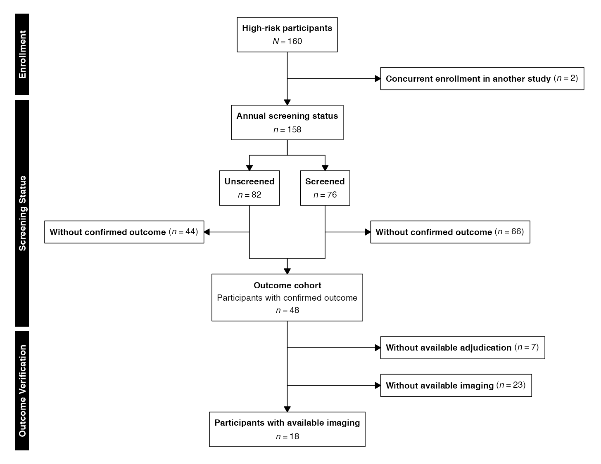
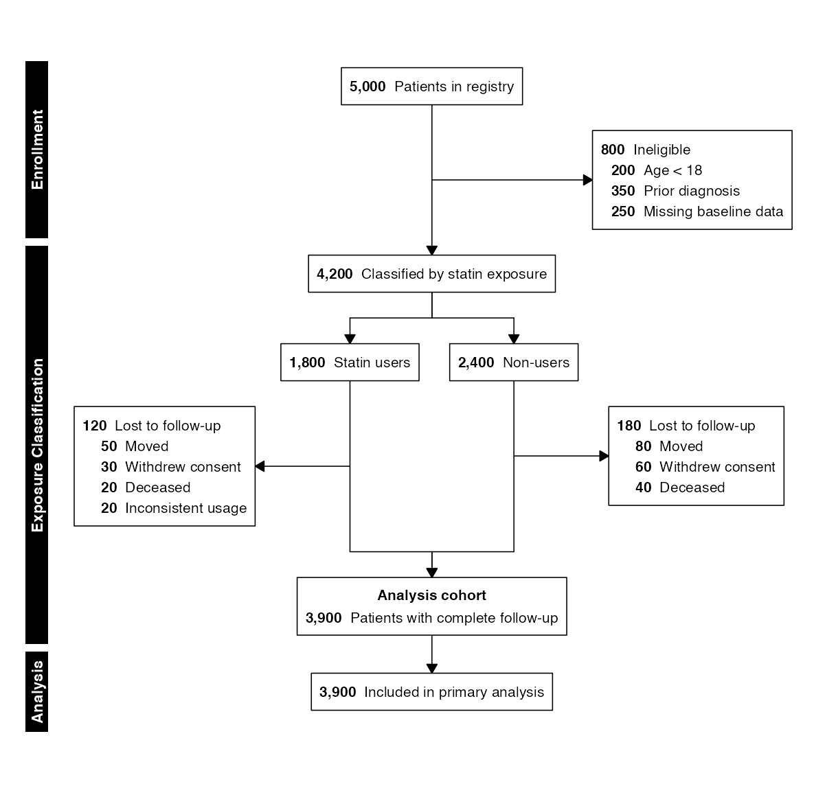
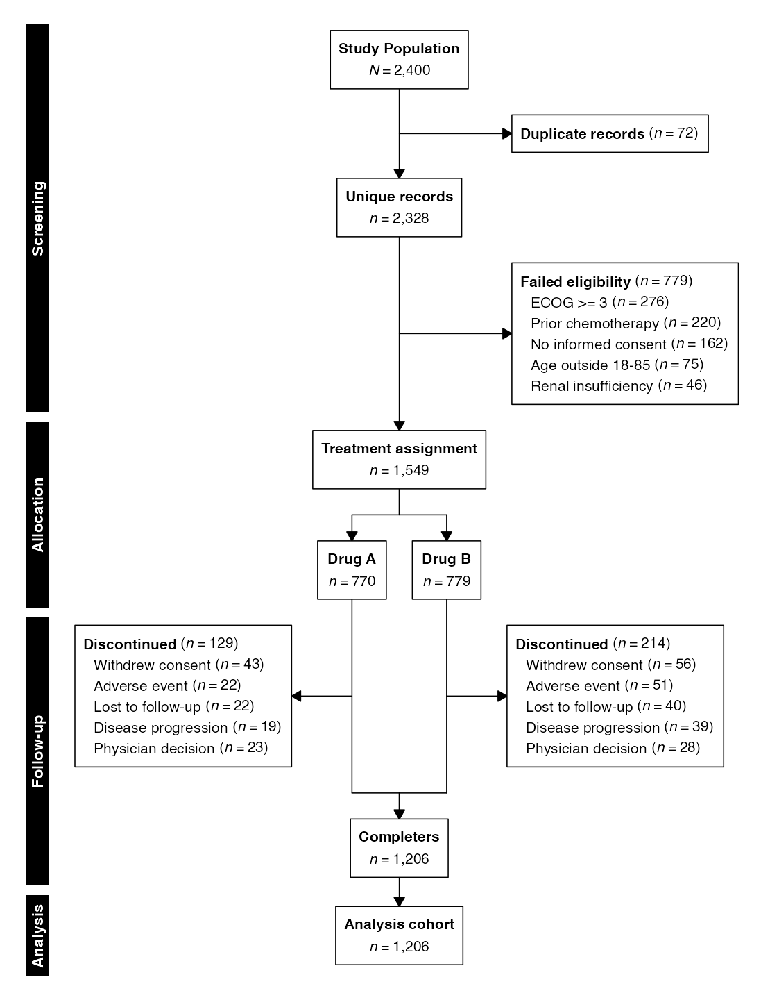
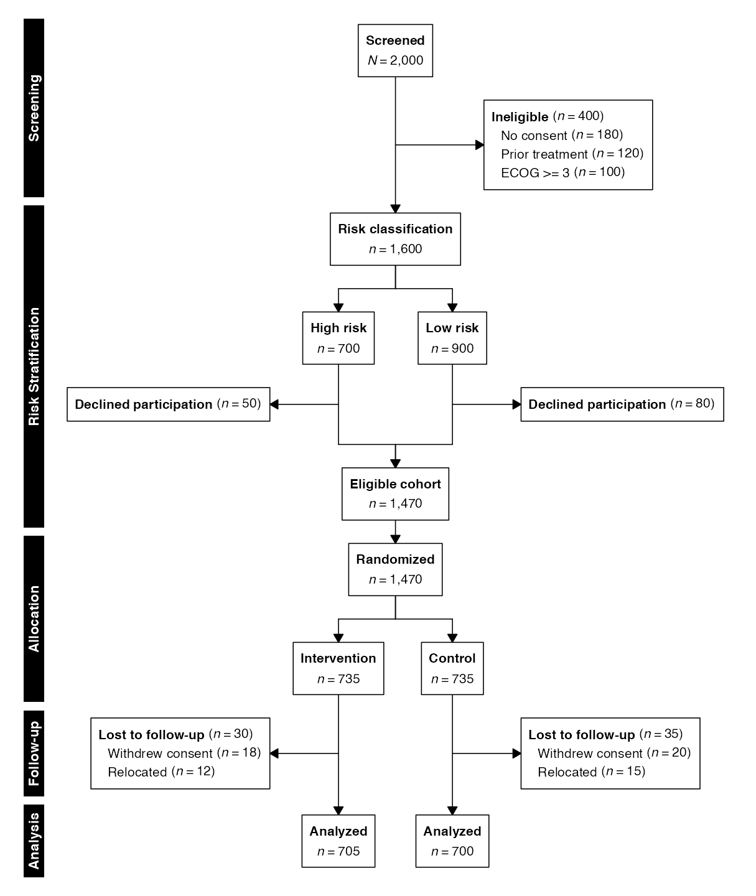

# Split-and-Recombine Diagrams

Many clinical studies divide a population into strata for independent
characterization, then recombine those strata into a single cohort for
downstream analysis. This split-and-recombine pattern arises in
screening validation studies, exposure-stratified observational cohorts,
and adaptive trial designs that classify patients before randomization.
It represents a third flow topology in `selecta`, distinct from both
permanent parallel arms (*e.g.*, CONSORT/STROBE/STARD diagrams) and
top-level source convergence (*e.g.*, PRISMA/MOOSE diagrams).

In `selecta`, split-and-recombine diagrams are built around the
following core functions:

| Function | Purpose |
|:---|:---|
| [`enroll()`](https://phmcc.codeberg.page/selecta/reference/enroll.md) | Establish the starting cohort from data or a manual count |
| [`stratify()`](https://phmcc.codeberg.page/selecta/reference/stratify.md) | Divide the flow into parallel strata |
| [`combine()`](https://phmcc.codeberg.page/selecta/reference/combine.md) | Merge strata back into a single downstream flow |

Thus, the split-and-recombine pipeline adheres to the following basic
structure:

``` r
enroll(...) |>
  exclude(...) |>
  stratify(labels, n, label) |>
  exclude(...) |>
  combine(label, sublabel) |>
  exclude(...) |>
  endpoint(label) |>
  flowchart()
```

where
[`stratify()`](https://phmcc.codeberg.page/selecta/reference/stratify.md)
fans out to parallel arms and
[`combine()`](https://phmcc.codeberg.page/selecta/reference/combine.md)
converges arms back together. Between the split and the recombination,
[`exclude()`](https://phmcc.codeberg.page/selecta/reference/exclude.md)
calls apply independently within each stratum, producing per-stratum
side boxes.

> *n.b.:* To ensure correct font rendering and figure sizing, the
> diagrams below are displayed using a vignette-only helper function
> (`queue_flow()`) that applies recommended dimensions from
> [`recdims()`](https://phmcc.codeberg.page/selecta/reference/recdims.md)
> via the [`ragg`](https://ragg.r-lib.org/) graphics device, with the
> standard output function applied afterwards
> ([`flowchart()`](https://phmcc.codeberg.page/selecta/reference/flowchart.md)).
> In practice, replace this
> `queue_flow()`/[`flowchart()`](https://phmcc.codeberg.page/selecta/reference/flowchart.md)
> workflow with a call to
> [`flowsave()`](https://phmcc.codeberg.page/selecta/reference/flowsave.md)
> for equivalent printed results:
>
> ``` r
> flowsave(flow, "consort.pdf")
> flowsave(flow, "consort.png", dpi = 300)
> ```
>
> Using
> [`flowsave()`](https://phmcc.codeberg.page/selecta/reference/flowsave.md)
> ensures that the figure dimensions are always large enough to
> accommodate the diagram content, and it is the preferred method for
> saving flow diagram outputs in `selecta`.

------------------------------------------------------------------------

## Preliminaries

``` r
library(selecta)
library(data.table)

data(selectaex2)
```

------------------------------------------------------------------------

## Manual Entry

### **Example 1:** Screening Validation Study

In screening-validation studies, a high-risk population is stratified by
whether participants received an annual screening protocol. The strata
are then characterized independently with respect to outcomes of
interest, after which they are recombined into a single confirmed cohort
for downstream analysis:

``` r
example1 <- enroll(n = 160,
                         label = "High-risk participants") |>
    phase("Enrollment") |>
    exclude("Concurrent enrollment in another study", n = 2,
            included_label = "Total cohort") |>
    phase("Screening Status") |>
    stratify(
        labels = c("Unscreened", "Screened"),
        n = c(82, 76),
        label = "Annual screening status"
    ) |>
    exclude("Without confirmed outcome", n = c(44, 66)) |>
    combine("Outcome cohort",
            sublabel = "Participants with confirmed outcome") |>
    phase("Outcome Verification") |>
    exclude("Without available adjudication", n = 7) |>
    exclude("Without available imaging", n = 23) |>
    endpoint("Participants with available imaging")
```

``` r
flowchart(example1)
```



The
[`stratify()`](https://phmcc.codeberg.page/selecta/reference/stratify.md)
function creates the downward split, and
[`combine()`](https://phmcc.codeberg.page/selecta/reference/combine.md)
draws converging arrows from each stratum back to a single node. Between
the two,
[`exclude()`](https://phmcc.codeberg.page/selecta/reference/exclude.md)
is called once with a vector of per-stratum counts (`n = c(44, 66)`),
producing one side box per column. In
[`combine()`](https://phmcc.codeberg.page/selecta/reference/combine.md),
the `sublabel` parameter writes a descriptive second line below the main
heading inside the recombined node, and the flow continues as a single
stream with standard exclusion steps.

### **Example 2:** Per-Stratum Exclusion Reasons

When per-stratum attrition has distinct causes, the `reasons` argument
accepts a list of named vectors (one per stratum). Reason ordering is
harmonized across strata using global totals, consistent with the
behavior of per-arm reasons after
[`allocate()`](https://phmcc.codeberg.page/selecta/reference/stratify.md):

``` r
example2 <- enroll(n = 5000, label = "Patients in registry") |>
    phase("Enrollment") |>
    exclude("Ineligible", n = 800,
            reasons = c("Age < 18" = 200,
                        "Prior diagnosis" = 350,
                        "Missing baseline data" = 250),
            included_label = "Eligible cohort") |>
    phase("Exposure Classification") |>
    stratify(
        labels = c("Statin users", "Non-users"),
        n = c(1800, 2400),
        label = "Classified by statin exposure"
    ) |>
    exclude("Lost to follow-up", n = c(120, 180),
            reasons = list(
                c("Moved" = 50, "Withdrew consent" = 30, "Deceased" = 20, "Inconsistent usage" = 20),
                c("Moved" = 80, "Withdrew consent" = 60, "Deceased" = 40)
            )) |>
    combine("Analysis cohort",
            sublabel = "Patients with complete follow-up") |>
    phase("Analysis") |>
    endpoint("Included in primary analysis")
```

``` r
flowchart(example2, count_first = TRUE)
```



------------------------------------------------------------------------

## Data-Driven Flow

In data mode,
[`stratify()`](https://phmcc.codeberg.page/selecta/reference/stratify.md)
accepts a column name rather than explicit labels and counts. The
[`combine()`](https://phmcc.codeberg.page/selecta/reference/combine.md)
function recombines the per-stratum datasets internally, and
[`cohort()`](https://phmcc.codeberg.page/selecta/reference/cohort.md)
returns the unified post-recombination dataset.

### **Example 3:** Data-Driven Split and Recombine

The following example uses the `selectaex2` dataset, stratifying by
treatment assignment and recombining after documenting per-arm
discontinuation:

``` r
example3 <- enroll(selectaex2, id = "patient_id") |>
    phase("Screening") |>
    exclude("Duplicate records", criterion = is_duplicate == TRUE,
            included_label = "Unique records") |>
    exclude("Failed eligibility", criterion = eligible == FALSE,
            reasons = "exclusion_reason",
            included_label = "Eligible cohort") |>
    phase("Allocation") |>
    stratify("treatment", label = "Treatment assignment") |>
    phase("Follow-up") |>
    exclude("Discontinued", criterion = discontinued == TRUE,
            reasons = "discontinuation_reason") |>
    combine("Completers") |>
    phase("Analysis") |>
    endpoint("Analysis cohort")
```

``` r
flowchart(example3)
```



------------------------------------------------------------------------

## Cohort Extraction

The
[`cohort()`](https://phmcc.codeberg.page/selecta/reference/cohort.md)
and
[`cohorts()`](https://phmcc.codeberg.page/selecta/reference/cohorts.md)
functions work with split-and-recombine flows. After a
[`combine()`](https://phmcc.codeberg.page/selecta/reference/combine.md)
step,
[`cohort()`](https://phmcc.codeberg.page/selecta/reference/cohort.md)
returns the unified recombined dataset rather than a per-arm list:

``` r
final <- cohort(example3)
dim(final)
#> [1] 1206   17
```

The
[`cohorts()`](https://phmcc.codeberg.page/selecta/reference/cohorts.md)
function captures snapshots at every stage, including the combine point.
Each snapshot records the remaining and excluded datasets:

``` r
stages <- cohorts(example3)
names(stages)
#> [1] "_start"             "Duplicate records"  "Failed eligibility" "_arm"               "Discontinued"       "Completers"         "Analysis cohort"
```

The combine snapshot contains the recombined dataset:

``` r
nrow(stages[["Completers"]]$included)
#> [1] 1206
```

Per-arm snapshots from the stratified region are available at the
exclusion step labels. These contain named lists (one element per arm)
rather than single datasets:

``` r
disc <- stages[["Discontinued"]]
vapply(disc$included, nrow, integer(1L))
#> Drug A Drug B 
#>    641    565
vapply(disc$excluded, nrow, integer(1L))
#> Drug A Drug B 
#>    129    214
```

This supports a complete analytical workflow: define the enrollment
flow, render the diagram, and extract any intermediate or final cohort
for downstream analysis.

------------------------------------------------------------------------

## Re-Splitting after Recombination

A flow may be split, recombined, and then split again. This arises in
adaptive designs where patients are first characterized by a baseline
variable, recombined, and then randomized. The
[`stratify()`](https://phmcc.codeberg.page/selecta/reference/stratify.md)
function permits a second split after
[`combine()`](https://phmcc.codeberg.page/selecta/reference/combine.md)
has closed the first:

### **Example 4:** Risk Stratification Followed by Randomization

``` r
example4 <- enroll(n = 2000, label = "Screened") |>
    phase("Screening") |>
    exclude("Ineligible", n = 400,
            reasons = c("No consent" = 180, "Prior treatment" = 120,
                        "ECOG >= 3" = 100)) |>
    phase("Risk Stratification") |>
    stratify(
        labels = c("High risk", "Low risk"),
        n = c(700, 900),
        label = "Risk classification"
    ) |>
    exclude("Declined participation", n = c(50, 80)) |>
    combine("Eligible cohort") |>
    phase("Allocation") |>
    allocate(labels = c("Intervention", "Control"),
             n = c(735, 735)) |>
    phase("Follow-up") |>
    exclude("Lost to follow-up", n = c(30, 35),
            reasons = list(
                c("Withdrew consent" = 18, "Relocated" = 12),
                c("Withdrew consent" = 20, "Relocated" = 15)
            )) |>
    phase("Analysis") |>
    endpoint("Analyzed")
```

``` r
flowchart(example4)
```



The layout engine scopes each split-combine span independently, so the
converge arrows from the first split do not interfere with the second
split’s arm positions. The second split may use either
[`stratify()`](https://phmcc.codeberg.page/selecta/reference/stratify.md)
(for observational grouping) or
[`allocate()`](https://phmcc.codeberg.page/selecta/reference/stratify.md)
(for randomization); both are permitted after a prior
[`combine()`](https://phmcc.codeberg.page/selecta/reference/combine.md).

------------------------------------------------------------------------

## Design Considerations

The split-and-recombine topology works well for two-stratum splits with
or without per-stratum side boxes. For three or more strata, flowcharts
will similarly render without collisions or overlap, but any per-stratum
side boxes may produce asymmetry due to the geometric limitations of the
split-and-recombine flow. In such cases, consider simplifying the
per-stratum detail or using external graphics editing software for full
control over the layout.

------------------------------------------------------------------------

## Saving to File

The
[`flowsave()`](https://phmcc.codeberg.page/selecta/reference/flowsave.md)
function saves the diagram to a file (PDF, PNG, SVG, or TIFF) with
auto-computed dimensions:

``` r
flowsave(example1, "screening_validation.pdf")
flowsave(example1, "screening_validation.png", dpi = 300)
```

Explicit dimensions override the automatic calculation:

``` r
flowsave(example1, "screening_validation.pdf", width = 10, height = 12)
```

All visual parameters accepted by
[`flowchart()`](https://phmcc.codeberg.page/selecta/reference/flowchart.md)
are also accepted by
[`flowsave()`](https://phmcc.codeberg.page/selecta/reference/flowsave.md):

``` r
flowsave(example1, "screening_validation_cf.pdf",
         count_first = TRUE, cex = 1.0, cex_side = 0.8)
```

------------------------------------------------------------------------

## Further Reading

- [Enrollment
  Diagrams](https://phmcc.codeberg.page/selecta/articles/enrollment_diagrams.md):
  CONSORT, STROBE, and STARD diagrams with permanent parallel arms
- [Systematic
  Reviews](https://phmcc.codeberg.page/selecta/articles/systematic_reviews.md):
  PRISMA and MOOSE diagrams with top-level source convergence
- [Advanced
  Workflows](https://phmcc.codeberg.page/selecta/articles/advanced_workflows.md):
  Factorial (nested-split) designs and hierarchical exclusion reasons
- [Graphviz
  Export](https://phmcc.codeberg.page/selecta/articles/graphviz_export.md):
  DOT output for Graphviz/DiagrammeR rendering
