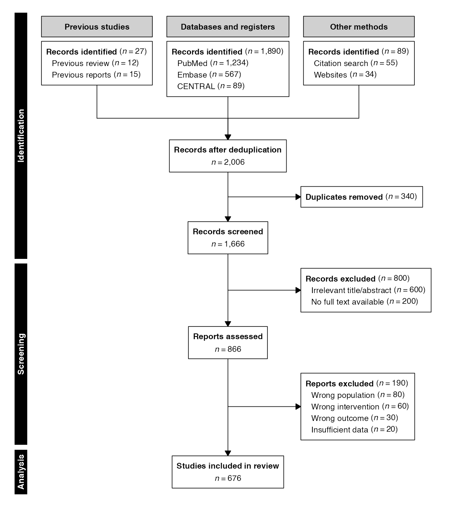
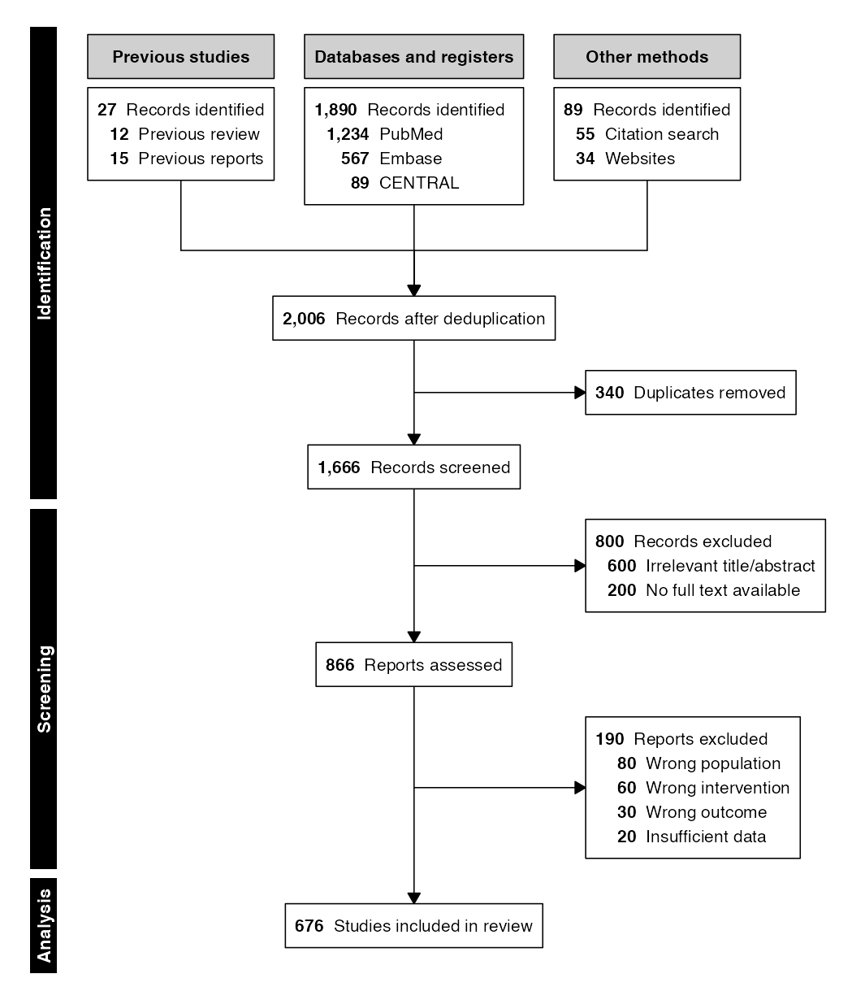
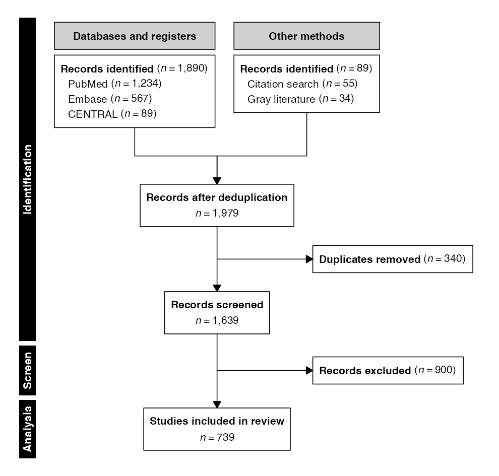
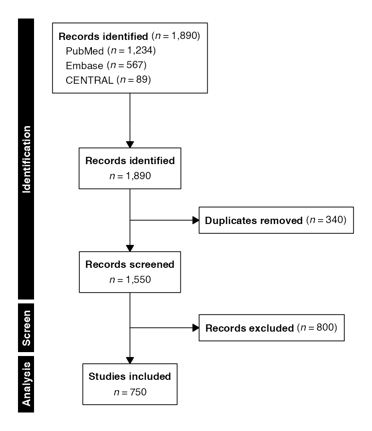
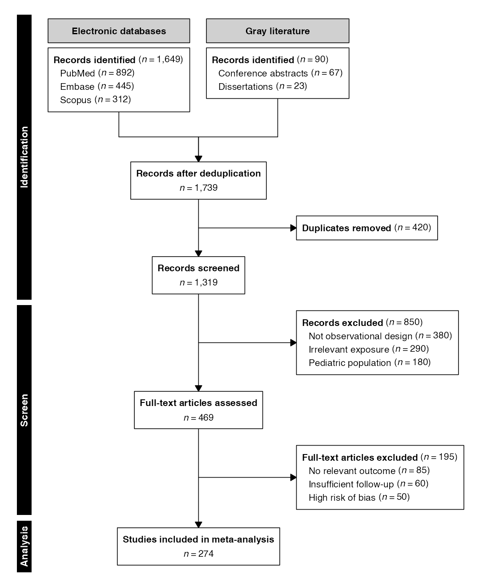

# Systematic Reviews

Systematic reviews and meta-analyses synthesize evidence across multiple
studies, requiring a transparent account of the literature search and
selection process. The PRISMA 2020 (Preferred Reporting Items for
Systematic Reviews and Meta-Analyses) statement prescribes a flow
diagram with a distinctive structure: multiple parallel identification
streams converge into a single screening flow, with progressive
exclusions at each stage. The MOOSE (Meta-analysis of Observational
Studies in Epidemiology) guidelines follow a similar pattern for
observational evidence synthesis.

In `selecta`, systematic review diagrams are built around the following
core functions:

| Function | Purpose |
|:---|:---|
| [`sources()`](https://phmcc.codeberg.page/selecta/reference/sources.md) | Define parallel identification streams (the entry point, replacing [`enroll()`](https://phmcc.codeberg.page/selecta/reference/enroll.md)) |
| [`combine()`](https://phmcc.codeberg.page/selecta/reference/combine.md) | Merge streams into a single flow after deduplication |

Thus, the systematic review pipeline adheres to the following basic
structure:

``` r
sources(...) |>
  phase("Identification") |>
  combine(label) |>
  exclude(label, n, reasons) |>
  phase("Screening") |>
  exclude(label, n) |>
  phase("Included") |>
  endpoint(label) |>
  flowchart()
```

where
[`sources()`](https://phmcc.codeberg.page/selecta/reference/sources.md)
is the entry point, and
[`combine()`](https://phmcc.codeberg.page/selecta/reference/combine.md)
merges parallel columns into a single downstream flow. This vignette
demonstrates the full range of systematic review diagrams supported by
`selecta`.

> *n.b.:* To ensure correct font rendering and figure sizing, the
> diagrams below are displayed using a vignette-only helper function
> (`queue_flow()`) that applies recommended dimensions from
> [`recdims()`](https://phmcc.codeberg.page/selecta/reference/recdims.md)
> via the [`ragg`](https://ragg.r-lib.org/) graphics device, with the
> standard output function applied afterwards
> ([`flowchart()`](https://phmcc.codeberg.page/selecta/reference/flowchart.md)).
> In practice, replace this
> `queue_flow()`/[`flowchart()`](https://phmcc.codeberg.page/selecta/reference/flowchart.md)
> workflow with a call to
> [`flowsave()`](https://phmcc.codeberg.page/selecta/reference/flowsave.md)
> for equivalent printed results:
>
> ``` r
> flowsave(flow, "consort.pdf")
> flowsave(flow, "consort.png", dpi = 300)
> ```
>
> Using
> [`flowsave()`](https://phmcc.codeberg.page/selecta/reference/flowsave.md)
> ensures that the figure dimensions are always large enough to
> accommodate the diagram content, and it is the preferred method for
> saving flow diagram outputs in `selecta`.

------------------------------------------------------------------------

## Preliminaries

``` r
library(selecta)
```

The examples in this vignette use manual mode exclusively, as systematic
review diagrams are typically constructed from summary counts reported
during the search and screening process rather than from a row-level
dataset.

------------------------------------------------------------------------

## PRISMA — Three-Column Layout

The PRISMA 2020 flow diagram uses up to three columns to organize
sources: studies from previous reviews (left), databases and registers
(center), and other methods such as citation searching and gray
literature (right). Each column receives a header label and one source
box listing individual databases or methods with their counts.

### **Example 1:** Full Three-Column PRISMA Diagram

The
[`sources()`](https://phmcc.codeberg.page/selecta/reference/sources.md)
function accepts named vector arguments, where each argument defines a
source group (column) and its named elements list the individual
sources:

``` r
example1 <- sources(
    previous  = c("Previous review" = 12, "Previous reports" = 15),
    databases = c("PubMed" = 1234, "Embase" = 567, "CENTRAL" = 89),
    other     = c("Citation search" = 55, "Websites" = 34),
    headers   = c(previous  = "Previous studies",
                  databases = "Databases and registers",
                  other     = "Other methods")
) |>
    phase("Identification") |>
    combine("Records after deduplication") |>
    exclude("Duplicates removed", n = 340,
            included_label = "Records screened") |>
    phase("Screening") |>
    exclude("Records excluded", n = 800,
            reasons = c("Irrelevant title/abstract" = 600,
                        "No full text available" = 200),
            included_label = "Reports assessed") |>
    exclude("Reports excluded", n = 190,
            reasons = c("Wrong population" = 80,
                        "Wrong intervention" = 60,
                        "Wrong outcome" = 30,
                        "Insufficient data" = 20)) |>
    phase("Analysis") |>
    endpoint("Studies included in review")
```

``` r
flowchart(example1)
```



The `headers` argument maps group names to display labels for the column
headers. If omitted, the argument names are title-cased and used
directly (*e.g.,* `databases` becomes “Databases”).

The
[`combine()`](https://phmcc.codeberg.page/selecta/reference/combine.md)
function inserts an inverted-Y convergence arrow connecting the parallel
source columns into a single downstream node. All subsequent pipeline
steps operate on the merged record pool.

### **Example 2:** Three-Column Count-First Layout

Like other diagram types, convergence-style diagrams can also be
formatted to have counts displayed before the category title.

``` r
flowchart(example1, count_first = TRUE)
```



------------------------------------------------------------------------

## PRISMA — Two-Column Layout

Many systematic reviews search only databases and one additional source
category. A two-column layout omits the “Previous studies” column:

### **Example 3:** Two-Column Sources

``` r
example3 <- sources(
    databases = c("PubMed" = 1234, "Embase" = 567, "CENTRAL" = 89),
    other     = c("Citation search" = 55, "Gray literature" = 34),
    headers   = c(databases = "Databases and registers",
                  other     = "Other methods")
) |>
    phase("Identification") |>
    combine("Records after deduplication") |>
    exclude("Duplicates removed", n = 340,
            included_label = "Records screened") |>
    phase("Screen") |>
    exclude("Records excluded", n = 900) |>
    phase("Analysis") |>
    endpoint("Studies included in review")
```

``` r
flowchart(example3)
```



------------------------------------------------------------------------

## PRISMA — Single-Column Layout

For simple reviews that search a single set of databases without
grouping,
[`sources()`](https://phmcc.codeberg.page/selecta/reference/sources.md)
accepts individual scalar arguments. These are consolidated into a
single source box with no column header:

### **Example 4:** Flat Source List

``` r
example4 <- sources(PubMed = 1234, Embase = 567, CENTRAL = 89) |>
    phase("Identification") |>
    combine("Records identified") |>
    exclude("Duplicates removed", n = 340,
            included_label = "Records screened") |>
    phase("Screen") |>
    exclude("Records excluded", n = 800) |>
    phase("Analysis") |>
    endpoint("Studies included")
```

``` r
flowchart(example4)
```



In this layout, no column headers are rendered and the source box
appears as a single centered node above the convergence point.

------------------------------------------------------------------------

## MOOSE — Observational Meta-Analysis

The MOOSE (Meta-analysis of Observational Studies in Epidemiology)
guidelines prescribe a flow diagram structurally similar to PRISMA,
tailored for observational evidence synthesis. The same
[`sources()`](https://phmcc.codeberg.page/selecta/reference/sources.md)
and
[`combine()`](https://phmcc.codeberg.page/selecta/reference/combine.md)
functions are used; only the labels and exclusion reasons reflect the
observational context:

### **Example 5:** MOOSE Flow Diagram

``` r
example5 <- sources(
    databases = c("PubMed" = 892, "Embase" = 445, "Scopus" = 312),
    gray      = c("Conference abstracts" = 67, "Dissertations" = 23),
    headers   = c(databases = "Electronic databases",
                  gray      = "Gray literature")
) |>
    phase("Identification") |>
    combine("Records after deduplication") |>
    exclude("Duplicates removed", n = 420,
            included_label = "Records screened") |>
    phase("Screen") |>
    exclude("Records excluded", n = 850,
            reasons = c("Not observational design" = 380,
                        "Irrelevant exposure" = 290,
                        "Pediatric population" = 180),
            included_label = "Full-text articles assessed") |>
    exclude("Full-text articles excluded", n = 195,
            reasons = c("No relevant outcome" = 85,
                        "Insufficient follow-up" = 60,
                        "High risk of bias" = 50)) |>
    phase("Analysis") |>
    endpoint("Studies included in meta-analysis")
```

``` r
flowchart(example5)
```



------------------------------------------------------------------------

## Source Group Structure

The
[`sources()`](https://phmcc.codeberg.page/selecta/reference/sources.md)
function distinguishes between two input patterns based on the structure
of its arguments:

| Pattern | Input                  | Layout                   | Headers        |
|:--------|:-----------------------|:-------------------------|:---------------|
| Flat    | Scalar named arguments | Single column, no header | None           |
| Grouped | Named vector arguments | One column per group     | Auto or custom |

**Flat sources** (*e.g.,* `sources(PubMed = 1234, Embase = 567)`) treat
each argument as an individual database. All sources are consolidated
into a single box.

**Grouped sources** (*e.g.,*
`sources(databases = c("PubMed" = 1234, "Embase" = 567))`) treat each
argument as a group. The argument name identifies the group, and its
named elements list the individual databases within that group. Each
group is rendered as a separate column with an optional header.

Up to three groups are supported, matching the three-column PRISMA 2020
template. The `headers` argument provides custom display labels; when
omitted, group names are title-cased automatically.

------------------------------------------------------------------------

## Saving to File

The
[`flowsave()`](https://phmcc.codeberg.page/selecta/reference/flowsave.md)
function saves the diagram to a file (PDF, PNG, SVG, or TIFF) with
auto-computed dimensions:

``` r
flowsave(example1, "prisma_3col.pdf")
flowsave(example1, "prisma_3col.png", dpi = 300)
```

Explicit dimensions override the automatic calculation:

``` r
flowsave(example1, "prisma_3col.pdf", width = 10, height = 12)
```

All visual parameters accepted by
[`flowchart()`](https://phmcc.codeberg.page/selecta/reference/flowchart.md)
are also accepted by
[`flowsave()`](https://phmcc.codeberg.page/selecta/reference/flowsave.md):

``` r
flowsave(example1, "prisma_poster.pdf",
         cex = 1.1, cex_side = 0.85, cex_phase = 1.1)
```

------------------------------------------------------------------------

## Further Reading

- [Enrollment
  Diagrams](https://phmcc.codeberg.page/selecta/articles/enrollment_diagrams.md):
  CONSORT, STROBE, and STARD diagrams with permanent parallel arms
- [Split-and-Recombine
  Diagrams](https://phmcc.codeberg.page/selecta/articles/split_recombine.md):
  Hybrid topologies for screening validation and exposure classification
- [Advanced
  Workflows](https://phmcc.codeberg.page/selecta/articles/advanced_workflows.md):
  Factorial (nested-split) designs and hierarchical exclusion reasons
- [Graphviz
  Export](https://phmcc.codeberg.page/selecta/articles/graphviz_export.md):
  DOT output for Graphviz/DiagrammeR rendering
